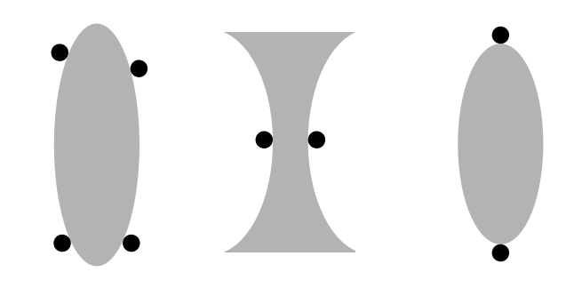
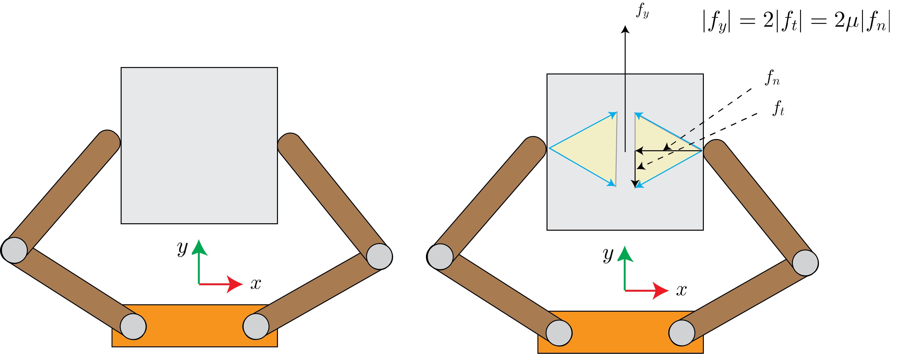
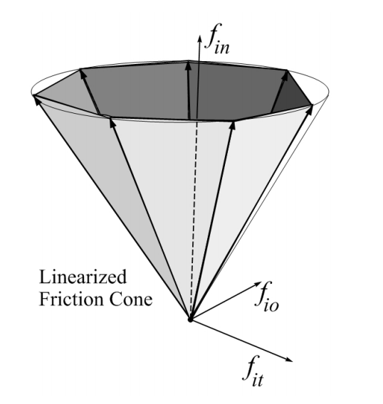

# Grasp Analysis

Grasping is a fundamental skill in manipulation and has broad application to many tasks. While the 
term *"grasping"* has many interpretations and definitions, here we will refer to an object 
rigidly held by the robot as a grasp. Specifically, the robot is permitted to make contact with the object 
at a known number of points and is only able to impart forces through these contacts. If the set of forces 
imparted to the object satisfy a set of requirements that we will study in this section, then the robot 
has successfully grasped the object. The goal of this section is to study the conditions under which a given
grasp is stable. This is referred to as **Grasp Analysis**. In later chapters, we will dedicate time to
**Grasp Synthesis**, where the goal is to compute a grasp rather than assume that one is given.

The robot can pick and place grasped objects and/or use them as tools to interact with its environment. 
A real-world example of a robotic system grasping objects autonomously is shown in Fig. 1.

<figure>

  

<figcaption> 
  <b>Fig. 1:</b> Real-world grasping system -- Team MIT-Princeton's entry into the Amazon Robotics Challenge (2016-2017)
</figcaption>
</figure>

In this section, we will assume all bodies are rigid and that Coulomb friction holds. In the remainder of this 
section we will develop the grasp matrix, a fundamental tool in analyzing grasp quality, 
and draw connections to the contact Jacobian we have studied previously. We will then use the grasp matrix 
to evaluate form and force closures of grasps to evaluate the stability of grasps. These properties are central 
to the task of planning for and controlling grasps and we will touch on these in subsequent chapters. 

In the remainder, our analysis follows the excellent Grasping chapter of \citet{prattichizzo2016grasping} 
and we refer the reader to this text for further details.

## Grasp Matrix

Let's consider an object being grasped by our robot, e.g. the one depicted in Fig. 2. 
The robot makes $N$ points of contacts with the object. The forces imparted by the robot to the object are 
governed by Coulomb friction. We will restrict our selves to the class of point contacts. For this class, 
each contact force $\mathbf{f}_{c,i}$ for $i=1, ..., N$ can be written in the contact frame as:

$$
\begin{align*}
    \mathbf{f}_{c,i} = \begin{bmatrix} f_n \\ f_{t,1} \\ f_{t,2} \end{bmatrix}\; \text{in 3D;} \quad \quad \mathbf{f}_{c,i} = \begin{bmatrix} f_n \\ f_{t} \end{bmatrix}\; \text{in 2D}
\end{align*}
$$

<figure>

  

<figcaption> 
  <b>Fig. 2:</b> Example of a grasp with 2 fingers, each with two joints.
</figcaption>
</figure>

From [Preliminaries](preliminaries.md) section, we know that we can project this force into the reference 
frame of the object using the contact Jacobian:

$$
\begin{align*}
    \mathbf{w}_i = \mathrm{J}_{c,i} \mathbf{f}_i
\end{align*}
$$

where $\mathbf{w}_i$ denotes the wrench in the object frame corresponding to the 
force $\mathbf{f}_i$. Since $\mathbf{f}_i$ is governed by Coulomb friction, the corresponding 
wrench is due to the projection of the friction cone into the reference frame of the object. 
By summing up the individual contributions of all external forces applied by the robot to the 
object we have a composite friction cone, similar to the 2 point contact case in planar pushing. We may write:

$$
\begin{align*}
    \mathbf{w} = \sum_{i=1}^N \mathbf{w}_i = \sum_{i=1}^N \mathrm{J}_{c,i} \mathbf{f}_i = \begin{bmatrix} \mathrm{J}_{c,1} & ... & \mathrm{J}_{c,N} \end{bmatrix} \begin{bmatrix} \mathbf{f}_1 \\ ... \\ \mathbf{f}_N \end{bmatrix} = \mathrm{G} \mathbf{f}
\end{align*}
$$

where $\mathrm{G}$ denotes the grasp matrix. In general, the grasp matrix is $6\times 3N$ dimensional 
for frictional point contacts with rigid bodies. Given the grasp matrix (which implicitly encodes 
the location of the grasps) and the coefficient of friction (to determine the friction cones), a grasp 
is fully identified. Note that the composite friction wrench has an identical definition to the grasp matrix.  

In our derivation so far, we have implicitly assumed that the fingers of the robot are able to impart 
$\mathbf{f}_i$. In practice, the robots actuated joints can apply torques that are transmitted to the contact 
point through a set of contact Jacobians as well. We may write this as:

$$
\begin{align*}
    \mathbf{f}_i = \bar{\mathrm{J}}_{c,i} \mathbf{\tau}
\end{align*}
$$

where we have used the bar notation to differentiate between the finger Jacobian and object Jacobian, 
and the robot actuation is denoted as $\mathbf{\tau}$. With this consideration, a grasp is fully defined 
by the grasp matrix $\mathrm{G}$, the robot Jacobians $\bar{\mathrm{J}}_{c,i}$, and the coefficients of 
friction at the points of contact.

One intuitive interpretation of the grasp matrix is that given a set of contact points and coefficients 
of friction, we can compute all the external wrenches we can apply to the object that can be resisted by 
the fingers. Another intuitive interpretation is that the grasp matrix qualifies the set of motions the 
object is not able to make given a grasp. In the following sections, we formalize these notions into a 
rigorous mathematical framework for grasp analysis.

## Grasp Analysis - Form Closure

With the grasp matrix in hand, we are now staged to begin our discussion on useful types of grasps. 
We will begin with the notion of form closure. Intuitively, if the grasped object is in form closure 
then it is fully geometrically immobilized by the set contacts. We cannot perturb the object's 
configuration without violating any contact constraints; i.e. non-penetration. This simply means 
that any change in the configuration of the object with respect to the robot would lead to penetration of 
the object and is therefore impossible. This intuitive explanation is precisely how we write down and 
solve for form closure. 

Before diving into the mathematical derivation, let's go through some examples. Take a look at Fig. 3. 
Which of these grasps are form closures? The first grasp is in form closure of first order. The second 
grasp is not in form closure of the first order, but it is in form closure of the second order. The third 
grasp is not in form closure at all. To understand the form closure of the second grasp, try to imagine a change 
in configuration of the object that does not violate the non-penetration constraint. Can you find 
such a change?

<figure>

  

<figcaption> 
  <b>Fig. 3:</b> Which of the above are form closures? This image is from \citet{prattichizzo2016grasping}
</figcaption>
</figure>

Now for th derivation: As in the previous subsection, let's assume that there are a total of $N$ frictional contacts, each 
applying a force $\mathbf{f}_i$ at contact points $i=1, ..., N$. For each contact point, we define a 
distance function $\psi_i(\mathbf{q}, \mathbf{q}_c)$ for $i=1, ..., N$, where $\mathbf{q}$ denotes 
the object configuration and $\mathbf{q}_c$ denotes the configuration of the fingers. Together, these 
configurations specify the distance to contact for each contact point $i$. $\psi_i > 0$ implies separation, 
$\psi_i < 0$ implies penetration, and $\psi_i = 0$ implies contact. Let's assume all $N$ contacts are 
active; i.e. that $\psi_i=0$ for all $i$. Fig. 3 illustrates the distance functions 
for the grasp depicted in Fig. 2.

<figure>

  

<figcaption> 
  <b>Fig. 3:</b> Distance functions for thee grasp depicted in Fig.~\ref{fig:chap1:canon}.
</figcaption>
</figure>

For form closure to hold, we require that:

$$
\begin{align*}
    \mathbf{\psi}(\mathbf{q} + d\mathbf{q}, \mathbf{q}_c) \geq = 0 \implies d\mathbf{q} = 0
\end{align*}
$$

where the expression is to be evaluated element-wise. Intuitively, if any infinitesimal perturbation 
to the configuration of the object results in separation without penetration, then form-closure is 
violated. Conversely, we cannot find any infinitesimal perturbation to the configuration of the object 
that does not violate the non-penetration constraint. While this constraint provides an effective definition 
for form closure, we cannot use it in its current form. The reason why we cannot use the constraints
as they are is that it would require us to check them for all possible $d\mathbf{q}$. Since this change in
configuration vector lives in $\mathbb{SO}(2)$ or $\mathbb{SO}(3)$, there is no way to do this. You'd have to
sample every single change in configuration vector, and there are infinitely many of them. 

You may be tempted to discretize and check at the discretization points, hoping that if the check holds at these
points, then it should hold for points in between. This check not only has that big assumption we'd be
worried about making, it would also be very expensive due to both the number of times we'd have to 
perform it (once per discretization point which is high-dimensional) and that it involves a collision
check that can itself be very expensive (more on collision checking later in the notes).

An alternative approach is to think about the local change in contact point positions for an infinitesimal
change in the object configuration. More specifically, we can look at the gradient of the distance functions
as a function of the change in object configuration. This is a local approximation, specifically a first order
approximation that we can write in the form of:

$$
\begin{align*}
    \frac{\partial \mathbf{\psi}}{\partial \mathbf{q}} d\mathbf{q} \geq 0 \implies d\mathbf{q} = 0
\end{align*}
$$

This first order approaximation of the form closure should look like the first term in the Taylor expansion 
approximation of the form closure expression. The interpretation is the same as before; however, to a first 
order approximation of perturbation. By itself, this approximation has not really fixed anything,
we are still left with the original problem. However, the key insight is that we can relate the approximation 
to the grasp matrix. 

To see how, first we note that since $\mathbf{\psi}$ is the distance function, it's gradient is along the 
normal vectors of the contact frames at each contact point. We know that the grasp matrix is composed 
of the set of normal and tangential components of contact frames. Let's denote the grasp matrix composed 
of only the normal contact vectors as $\mathrm{G}_n$. The condition above can equivalently be written as:

$$
\begin{align*}
    \mathrm{G}^T_n \mathbf{v} \geq 0 \implies \mathbf{v} =0
\end{align*}
$$

where $\mathbf{v}$ denotes the instantaneous object velocity. To convince yourself of the equivalence, consider
that:

$$
  \mathrm{G}^T_n = \frac{\partial \mathbf{\psi}}{\partial \mathbf{q}}
$$

Due to the definition of the distance function and the grasp matrix and that $\mathbf{v} = \frac{\mathbf{q}}{dt}$.
This means by simply dividing the original constraint by $dt$, we arrive at the equivalent velocity one. The implication 
in the constraint simply means that there is no set of object velocities that would lead to separation at any contact point. 
An equivalent formulation of this implication can be written for the set of contact forces 
applied to the object. Let's denote the magnitude of the normal component of the contact force 
as $\mathbf{f}_{n}$, then a grasp has first order form closure iff:

$$
\begin{align*}
    \mathrm{G}_n \mathbf{f}_n & = - \mathbf{g}  \quad \quad \forall \mathbf{g} \in \mathrm{R}^6 \\
    \mathbf{f}_n & \geq 0
\end{align*}
$$

The physical interpretation of this condition is that equilibrium can be maintained under the 
assumption that contacts are frictionless. We emphasize that $\mathbf{f}_n$ is only the magnitude 
of the normal component of the contact force and no other components. Since $\mathbf{g}$ is any 
vector in $\mathrm{R}^6$, for the inequality to hold we require that $\mathbf{g}$ be in the 
range of $\mathrm{G}_n$. Consequently, the rank of $\mathrm{G}_n$ must be 6 for the vector to 
lie in its range for all values it can take.

We can also write the condition for first order form closure as there exists $\mathbf{f}_n$ 
such that the following two conditions hold:

$$
\begin{align*}
    \mathrm{G}_n \mathbf{f}_n & = 0 \\
    \mathbf{f}_n & > 0
\end{align*}
$$

These conditions means that there exists a set of strictly compressive normal contact forces in the 
null space of $\mathrm{G}_n$. This also means that we can squeeze the object as tightly as we'd 
like while maintaining equilibrium (at no point will the object leave the grasp). If there were a
combination of squeezing forces for which equilibrium did not hold, then the object would accelerate.
Similarly, if we chose an external force along that direction, the object would leave the grasp. The 
search problem is now checking these conditions for all choices of $\mathbf{f}_n$. The first is a simple
linear equality constraint, and the second is a linear strict inequality constraint. These checks are very
easy to do with linear programs as we'll see in the next subsection.

In general, for the above conditions to hold, Somov 1897 proved that at least 7 contacts are necessary for a 6 degree of 
freedom object and 4 are required for the planar case. Fig. 4 shows some example form closures in the plane (with 4 points of contact).

<figure>

  

<figcaption> 
  <b>Fig. 4:</b> 2 examples of form closures in the plane with 4 points of contact. This image is from \citet{prattichizzo2016grasping}.
</figcaption>
</figure>

Geometrically, we can describe form closure using the composite friction cones we discussed in the 
previous sections. This idea is illustrated in Fig. 5.

<figure>

  

<figcaption> 
  <b>Fig. 5:</b> Geometric interpretation of the form closure. Each finger is permitted to only 
  apply a force along the normal. Consequently, wrench cones can be produced by having multiple 
  contacts with non-co-linear normals. If the resulting cone spans the entire wrench space, then form closure is possible.
</figcaption>
</figure>

## First order form closure tests

To test whether a grasp has form closure, we'd like to check whether we can find a $\mathbf{f}_n$ 
such that the following two conditions hold:

$$
\begin{align}
    \mathrm{G}_n \mathbf{f}_n & = 0 \\
    \mathbf{f}_n & > 0
\end{align}
$$

Let's denote the smallest component of $\mathbf{f}_n$ as $d$. If we can find $d>0$, it would 
imply that $\mathbf{f}_n >0$. We can do this with the following linear program:

$$
\begin{align}
    \textbf{LP1:} \quad \quad &  \text{maximize} \quad \quad & d &  \\
                              & \text{s.t.}  & \mathrm{G}_n \mathbf{f}_n &= 0 \\
                              &  & \mathrm{I} \mathbf{f}_n - \mathbf{1}d &\geq 0 \\
    &  & d & \geq 0 \\
    &  & \mathbf{1}^T \mathbf{f}_n &\leq N \\
\end{align}
$$

where $\mathrm{I}$ is the identity matrix and $\mathbf{1}$ is a vector with all components equal to 1. 
If this LP is infeasible or the optimal value $d^*$ is zero, then the grasp is not in form closure. 
We can formalize this procedure as follows:

**Form Closure Test:**

- Compute the rank of $\mathrm{G}_n$:
  - If this rank is less than 4 in the planar case or 7 in the 3D case, then form closure does not exist;
  - Else, the rank is adequate, proceed.  
- Solve LP1:
  - if $d^* = 0$ then form closure does not exist;
  - if $d^* > 0$ then form closure exists and $d^*$ is a crude measure of how far the grasp is from losing form closure

Intuitively, if the smallest term in $\mathbf{f}_n$ is close to zero, then $\mathrm{G}_n$ is close 
to loosing rank which means that normal vectors of contacts are close to being dependent. This means 
that our grasp is close to losing form closure. 

In summary, form closure is a fundamentally geometric constraint. It does not depend on frictional 
properties, rather it immobilizes the object using the concept of jamming. Form closure is a robust 
grasping strategy and a desirable one when it is possible to form. For the set of rigid-bodies, 
calculating form closure is equivalent to the solution of a linear program which can be done rapidly. 
One important drawback of form closure is the relatively large number of contacts required to 
produce it. In the following section, we study a different form of restraining that relies on contact 
mechanics and requires fewer contacts.

## Force Closure 

In form closure, we noted that the constraints against external wrenches and motion are entirely 
geometric. There was no need to consider forces but we did need a rather large number of contacts. 
In force closure, we require that the contacts can resist any object wrench (any set of external 
forces and torques applied to the center of mass of the object). The key difference is that we allow 
frictional forces to help maintain the grasp; i.e. resist the object wrench. The key contribution is 
then a reduced number of contacts by virtue of including frictional forces. In fact, for a 3D object, 
we only need 2 soft finger contacts or 3 hard finger contacts for force closure rather than the 7 
needed in form closure.

A fundamental requirement for form closure is that the hand/fingers must be able to squeeze arbitrarily 
tightly to account for any external wrench (no matter how large) applied to the object. For example, 
consider the object depicted in Fig.~\ref{fig:chap1:fc1}. The frictional force is able to resist any push 
we apply to the object along its $y$ axis with a line of action passing through the center of 
mass -- as long as there is enough normal force to produce sufficient frictional tangent force.

<figure>

  

<figcaption> 
  <b>Fig. 6:</b> Example of a force closure induced by a ``pinch grasp''. The tighter the 
  fingers pinch the object (yes that is actually a technical term), the more $y$ force 
  can be resisted by the frictional force at the fingers.
</figcaption>
</figure>

Since our discussion depends heavily on the finger type (and contact type), let's discuss 3 pervasive models:

**Friction-free:** This type of finger can only apply a force along the contact normal. It is not
permitted to apply tangential/frictional forces. Imagine this type of finger as made of ice!
We may write the contact force in the contact frame as:

$$
\begin{align*}
    \mathbf{f}_c = \begin{bmatrix} 0, & 0, & f_n, & 0, & 0, 0, & 0\end{bmatrix}^T
\end{align*}
$$

**Hard finger:** The contact is well approximated by a point. It is allowed to transmit a normal force,
and a tangential force in the contact plane.

$$
  \begin{align*}
      \mathbf{f}_c = \begin{bmatrix} f_{t,1}, & f_{t,2}, & f_n, & 0, & 0, & 0\end{bmatrix}^T
  \end{align*}
$$

with the constraint that:

$$
  \begin{align*}
      \sqrt{f^2_{t,1} + f^2_{t,2}} \leq \mu f_n
  \end{align*}
$$

**Soft finger:** The contact is well approximated by a patch. The patch can transmit the
same forces as a hard finger and an additional rotational torque, perpendicular to the contact plane.

$$
  \begin{align*}
      \mathbf{f}_c = \begin{bmatrix} f_{t,1}, & f_{t,2}, & f_n, & 0, & 0, & \tau_p\end{bmatrix}^T
  \end{align*}
$$

with the constraint that:

$$
\begin{align*}
    \frac{1}{\mu}\sqrt{f^2_{t,1} + f^2_{t,2}} + \frac{1}{\alpha \nu} \sqrt{\tau^2_p} \leq  f_n
\end{align*}
$$

where $\nu$ is the torsional friction coefficient and $\alpha$ is the characteristic
length of the object to ensure consistency of units between the force and torque components.

We note that while these are 3 simple models, they do an excellent job of describing a large set of fingers
that we may encounter. An important aspect of each of these definitions is that the contact reaction 
force lies in the friction cone induced by the type of contact and it's specific parameters. Specifically, 
for the hard finger, we can write the Coulomb friction cone $\mathcal{F}$:

$$
\begin{align*}
    \mathcal{F} = \{ (f_n, f_{t,1}, f_{t,2}) \quad | \quad \sqrt{f^2_{t,1} + f^2_{t,2}} \leq \mu f_n \}
\end{align*}
$$

and for the soft finger we can write the friction cone as:

$$
\begin{align*}
    \mathcal{F} = \{(f_n, f_{t,1}, f_{t,2}, \tau_p) \quad | \quad \frac{1}{\mu}\sqrt{f^2_{t,1} + f^2_{t,2}} + \frac{1}{\alpha \nu} \sqrt{\tau^2_p} \leq f_n \}
\end{align*}
$$

### Force Closure Definition

Recall from our form closure discussion that we defined a grasp as having form closure if:

$$
\begin{align*}
    \mathrm{G}_n \mathbf{f}_n & = - \mathbf{g} \\
    \mathbf{f}_n &> 0
\end{align*}
$$

for all external wrenches applies to the object. In the definition of force closure, 
we still require that the grasp resists all external wrenches applied to the object. 
However, we have an additional constraint on the contact force: the contact force at the 
point of contact must be in the interior or on the boundary of the friction cone. We can 
express these conditions mathematically as:

$$
\begin{align*}
    \mathrm{G} \mathbf{f}_c & = - \mathbf{g} \\
    \mathbf{f}_c  &\in  \mathcal{F}
\end{align*}
$$

where $\mathcal{F}$ denotes the composite friction cone as is defined as:

$$
\begin{align*}
    \mathcal{F} = \mathcal{F}_1 \times ... \times \mathcal{F}_N = \{ \mathbf{f}_{c,i}  \in \mathcal{F}_i; \quad i=1, ..., N \}
\end{align*}
$$

The key differences between the two definitions (form and force closure) are:

- we use the full grasp matrix (since we have tangential forces as well as normal forces),
- we use the full contact wrench (rather than just the normal force applied by the contact force),
- the contact wrench must belong to the friction cone.

Due to \citet{murray1994mathematical}, a grasp is said to have \textbf{frictional force closure} iff 
the following two conditions hold:

$$
\begin{align*}
    & rank(\mathrm{G}) = 3 \; (\text{planar}) \quad \text{or} \quad 6 \; (\text{3D}) \\
    & \exists \mathbf{f}_c \; \text{s.t.} \; \; \mathrm{G}\mathbf{f}_c=0 \quad \text{and} \quad \mathbf{f}_c \in Interior(\mathcal{F})
\end{align*}
$$

**A set of frictional contacts yields force closure if the positive span of the wrench cones is the entire wrench space.** 
The rank condition means that the composite wrench cone spans the entire wrench space. For the second 
condition, since $\mathbf{f}_c \geq 0$ this ensures that the positive span of the wrench cones spans the 
entire wrench space. 

Put another way, the first condition means that we want to span the space of all possible external wrenches 
exerted at the COM to be resisted by the contacts -- if we cannot span this space, then there will be some 
subset of directions in which we cannot resist an external force. The second condition means there exists 
a set of reaction forces that span the null space of the grasp matrix and are in the interior of the 
composite friction cone. To understand better what this means, consider that we'd like to solve:

$$
\begin{align*}
    \mathrm{G}\mathbf{f}_c = -\mathbf{g}
\end{align*}
$$

so we may write:

$$
\begin{align*}
    \mathbf{f}_c = - \mathrm{G}^\dagger \mathbf{g} + \bar{\mathrm{G}} \mathbf{f}_{c,null}
\end{align*}
$$

where the first term is the particular solution (pseudo inverse of $\mathrm{G}$ multiplied by 
the external wrench) and the second term $\bar{\mathrm{G}}$ (matrix with columns of the null space 
of $\mathrm{G}$) and $\mathbf{x}$ is the coefficient vector of the parameterization of the homogeneous 
solution. The set of internal contact forces: 

$$
\mathbf{f}_{c,int} = \bar{\mathrm{G}}\mathbf{f}_{c,null}
$$

do not affect the solution of the equation above; however, they play a key role in determining the stability 
of the grasp. They specify how tightly we can grasp the object. Without the null space, the grasp can at 
most resist only one particular value of externally applied wrenches.

The definition we provided above has one important short-coming. Can the fingers trying to attain 
force closure actually provide the necessary contact forces? We say that a grasp has **force closure** 
(a stronger condition than frictional force closure stated above) iff:

$$
\begin{align*}
    & rank(\mathrm{G}) = 3 \; (\text{planar}) \quad \text{or} \quad 6 \; (\text{3D}) \\
    & \mathcal{N}(\mathrm{G}) \cap \mathcal{N}(\mathrm{J}_f^T) = 0 \\
    & \exists \mathbf{f}_c \; \text{s.t.} \; \; \mathrm{G}\mathbf{f}_c=0 \quad \text{and} \quad \mathbf{f}_c \in Interior(\mathcal{F})
\end{align*}
$$

where the second condition states that the null space of grasp matrix and the null space of 
finger Jacobians do not share any elements other than the zero vector. Intuitively, the grasp 
can inherently resist a set of contact forces described by the null 
space $\mathcal{N}(\mathrm{G})$. $\mathcal{N}(\mathrm{J}_f^T)$ specifies the set of contact forces 
the fingers can resist structurally but no joint torque can affect (make any changes to). If 
these two spaces share elements, then it means that there exists a set of contact forces that 
the grasp can inherently resist but that the fingers are incapable of producing. This implies 
the fingers are incapable of securely maintaining the grasp.

An important challenge in testing for force closure of a grasp is the quadratic/conic constraints 
imposed by the friction cones at the contacts. One approach to simplifying the test for force 
closure is to approximate the friction cone with polyhedral cone. Fig.~\ref{fig:chap1:lin-cone} 
shows an example of a linearized friction cone. 

<figure>

  

<figcaption> 
  <b>Fig. 7:</b> An example of the linearized friction cone for the hard finger model.
</figcaption>
</figure>

Any of the friction cones we have discussed so far (induced by the friction free, hard finger, or 
soft finger) can be approximated by the non-negative span of a finite number $n_g$ of generators 
$\mathbf{s}_{ij}$ of the friction cone. We can represent the set of applicable contact forces at 
contact $i$ as:

$$
\begin{align*}
    \mathrm{G}_i \mathbf{f}_{c,i} = \mathrm{S}_i \mathbf{p}_i, \quad \mathrm{p}_i \geq 0
\end{align*}
$$

where: 

$$
\mathrm{S}_i = [\mathbf{s}_{i1} \cdots \mathbf{s}_{in_g}]
$$

and $\mathbf{p}_i$ is a vector of non-negative generator weights. Let's write the 
expressions for $\mathrm{S}_i$ for each type of contact:

**Friction free:** In this case the cone collapses to a line with $n_g = 1$
and: 

$$
\mathrm{S}_i = \begin{bmatrix}\hat{\mathbf{n}}_i^T \quad ((\mathbf{c}_i - \mathbf{p}) \times \hat{\mathbf{n}}_i)^T \end{bmatrix}^T
$$

**Hard finger:** The friction cone is represented by the non-negative sum of uniformly 
spaced contact force generators whose non-negative span approximates the Coulomb cone 
with an inscribed regular polyhedral cone. We can write:

$$
\begin{align*}
    \mathrm{S}_i = \begin{bmatrix} \cdots & 1 & \cdots \\ \cdots & \mu_i \text{cos}(2k\pi/n_g) & \cdots \\ \cdots & \mu_i \text{sin}(2k\pi/n_g) & \cdots  \end{bmatrix}
\end{align*}
$$

where $k=1, \cdots, n_g$.

**Soft finger:** Since the torsional friction in this model is decoupled from the tangential 
friction, it's generators are given by $[1 \; 0 \; 0 \; bv_i]^T$ and we can write:

$$
\begin{align*}
    \mathrm{S}_i = \begin{bmatrix} \cdots & 1 & \cdots & 1 & 1 \\ \cdots & \mu_i \text{cos}(2k\pi/n_g) & \cdots & 0 & 0 \\ \cdots & \mu_i\text{sin}(2k\pi/n_g) & \cdots & 0 & 0 \\ \cdots & 0 & \cdots & bv_i & -bv_i  \end{bmatrix}
\end{align*}
$$

where $b$ is a characteristic length used to unify the units and $v_i$ is the torsional friction coefficient.

This polyhedral approximation to the friction cone allows us to efficiently represent 
the friction cone as a set of linear inequalities:

$$
\begin{align*}
    \mathrm{F}_i \mathbf{f}_{ci} \geq 0
\end{align*}
$$

where $\mathrm{F}_i$ is a matrix whose rows are composed of the normals to the 
faces formed by two adjacent generators of the approximate cone. For example, in the 
hard finger contact, row $i$ of $\mathrm{F}_i$ can be computed as the cross product 
of $\mathbf{s}_i$ and $\mathbf{s}_{i+1}$. The intuitive interpretation of the inequalities is 
that we require the reaction force to be in the interior of the space created by the 
intersection of the set of half planes making up the sides of the friction cone. We can 
compose the set of all contact and their reaction forces in the compact form:

$$
\begin{align*}
    \mathrm{F} \mathbf{f}_{c} \geq 0
\end{align*}
$$

where $\mathrm{F} = \text{BlockDiag}(\mathrm{F}_1, \cdots, \mathrm{F}_{n_c})$.

We are now ready to test for force closure. Our procedure is as follows:

1. Compute the rank of $\mathrm{G}$:
   1. if the rank is 3 in the planar case or 6 in the 3D case, continue;
   2. else, force closure is not possible
2. Solve the frictional form closure linear program (LP2):
   
$$
\begin{align*}
\textbf{LP2:} \quad \quad &  \text{maximize} \quad \quad & d &  \\
                          & \text{s.t.}  & \mathrm{G} \mathbf{f}_c &= 0 \\
                          &  & \mathrm{F} \mathbf{f}_c - \mathbf{1}d &\geq 0 \\
&  & d & \geq 0 \\
&  & \mathbf{e}^T \mathbf{f}_n &\leq N
\end{align*}
$$

where the optimal value $d^*$ is a measure of the distance between the contact
force and the boundary of the friction cone. The larger this value, the more stable
the grasp. If $d^*=0$ then force closure is not possible. Here we
define $\mathbf{e}_i = [1 \; 0\; 0\; 0\; 0\; 0]$ and $\mathbf{e}=[\mathbf{e}_1, \cdots \mathbf{e}_{n_c}]$,
these vectors are responsible for picking out the normal component of the contact
force for each contact.

4. Solve the check for $\mathcal{N}(\mathrm{G}) \cap \mathcal{N}(\mathrm{J}^T)=0$ with LP3:

$$
\begin{align*}
\textbf{LP3:} \quad \quad &  \text{maximize} \quad \quad & d &  \\
                          & \text{s.t.}  & \mathrm{G} \mathbf{f}_c  &= 0 \\
                          &              & \mathrm{J}^T\mathbf{f}_c  & = 0 \\
                          &  & \mathrm{E} \mathbf{f}_c - \mathbf{1}d &\geq 0 \\
&  & d & \geq 0 \\
&  & \mathbf{e}^T \mathbf{f}_n &\leq N \\
\end{align*}
$$

where $\mathrm{E}=\text{BlockDiag}(\mathbf{e}_1, \cdots, \mathbf{e}_{n_c})$. If $d^*=0$ then force closure exists.

The polyhedral approximation to the friction cone is exact for the planar case and we can write:

$$
\begin{align*}
    \mathrm{F}_i = \frac{1}{\sqrt{1+\mu^2_i}} \begin{bmatrix} \mu_i & 1 \\ \mu_i & -1 \end{bmatrix}
\end{align*}
$$
