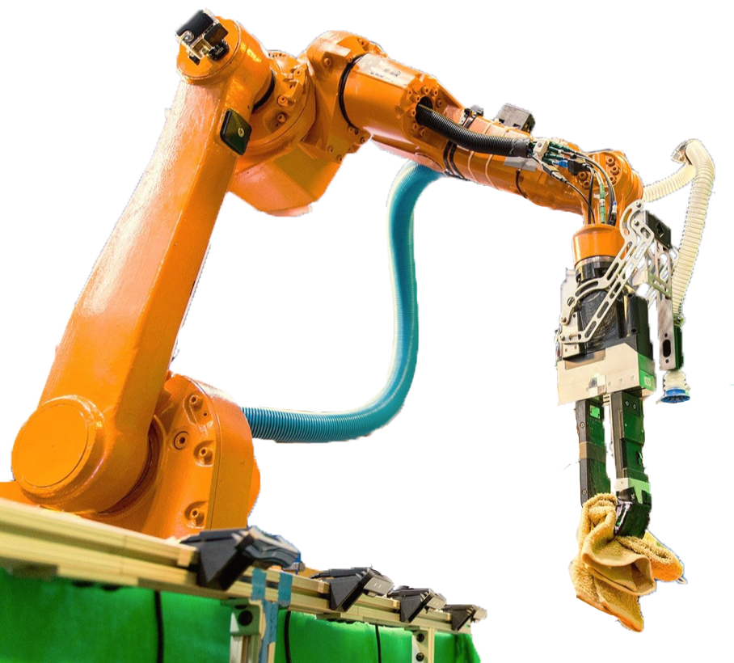
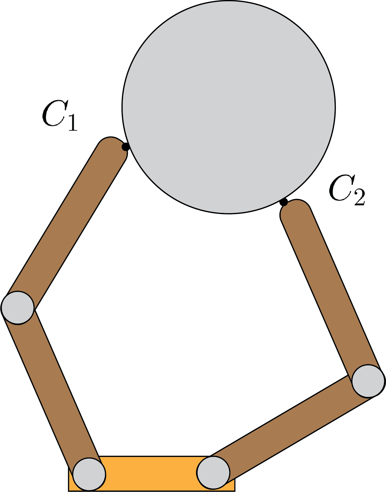
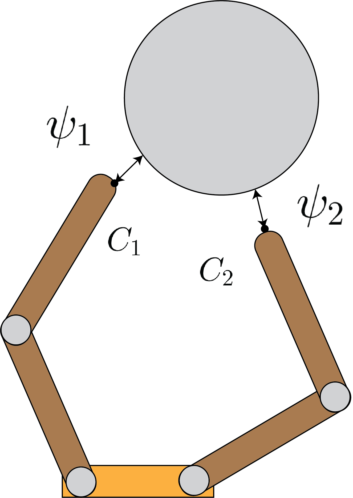
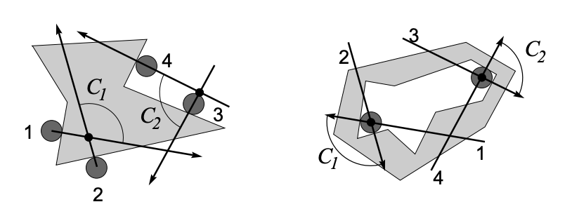
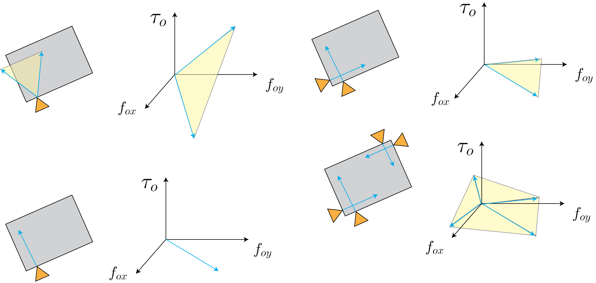

# Grasp Analysis

Grasping is a fundamental skill in manipulation and has broad application to many tasks. While the 
term *"grasping"* has many interpretations and definitions, here we will refer to an object 
rigidly held by the robot as a grasp. Specifically, the robot is permitted to make contact with the object 
at a known number of points and is only able to impart forces through these contacts. If the set of forces 
imparted to the object satisfy a set of requirements that we will study in this section, then the robot 
has successfully grasped the object. The goal of this section is to study the conditions under which a given
grasp is stable. This is referred to as **Grasp Analysis**. In later chapters, we will dedicate time to
**Grasp Synthesis**, where the goal is to compute a grasp rather than assume that one is given.

The robot can pick and place grasped objects and/or use them as tools to interact with its environment. 
A real-world example of a robotic system grasping objects autonomously is shown in Fig. 1.

<figure>

  

<figcaption> 
  <b>Fig. 1:</b> Real-world grasping system -- Team MIT-Princeton's entry into the Amazon Robotics Challenge (2016-2017)
</figcaption>
</figure>

In this section, we will assume all bodies are rigid and that Coulomb friction holds. In the remainder of this 
section we will develop the grasp matrix, a fundamental tool in analyzing grasp quality, 
and draw connections to the contact Jacobian we have studied previously. We will then use the grasp matrix 
to evaluate form and force closures of grasps to evaluate the stability of grasps. These properties are central 
to the task of planning for and controlling grasps and we will touch on these in subsequent chapters. 

In the remainder, our analysis follows the excellent Grasping chapter of \citet{prattichizzo2016grasping} 
and we refer the reader to this text for further details.

## Grasp Matrix

Let's consider an object being grasped by our robot, e.g. the one depicted in Fig. 2. 
The robot makes $N$ points of contacts with the object. The forces imparted by the robot to the object are 
governed by Coulomb friction. We will restrict our selves to the class of point contacts. For this class, 
each contact force $\mathbf{f}_{c,i}$ for $i=1, ..., N$ can be written in the contact frame as:

$$
\begin{align*}
    \mathbf{f}_{c,i} = \begin{bmatrix} f_n \\ f_{t,1} \\ f_{t,2} \end{bmatrix}\; \text{in 3D;} \quad \quad \mathbf{f}_{c,i} = \begin{bmatrix} f_n \\ f_{t} \end{bmatrix}\; \text{in 2D}
\end{align*}
$$

<figure>

  

<figcaption> 
  <b>Fig. 2:</b> Example of a grasp with 2 fingers, each with two joints.
</figcaption>
</figure>

From [Preliminaries](preliminaries.md) section, we know that we can project this force into the reference 
frame of the object using the contact Jacobian:

$$
\begin{align*}
    \mathbf{w}_i = \mathrm{J}_{c,i} \mathbf{f}_i
\end{align*}
$$

where $\mathbf{w}_i$ denotes the wrench in the object frame corresponding to the 
force $\mathbf{f}_i$. Since $\mathbf{f}_i$ is governed by Coulomb friction, the corresponding 
wrench is due to the projection of the friction cone into the reference frame of the object. 
By summing up the individual contributions of all external forces applied by the robot to the 
object we have a composite friction cone, similar to the 2 point contact case in planar pushing. We may write:

$$
\begin{align*}
    \mathbf{w} = \sum_{i=1}^N \mathbf{w}_i = \sum_{i=1}^N \mathrm{J}_{c,i} \mathbf{f}_i = \begin{bmatrix} \mathrm{J}_{c,1} & ... & \mathrm{J}_{c,N} \end{bmatrix} \begin{bmatrix} \mathbf{f}_1 \\ ... \\ \mathbf{f}_N \end{bmatrix} = \mathrm{G} \mathbf{f}
\end{align*}
$$

where $\mathrm{G}$ denotes the grasp matrix. In general, the grasp matrix is $6\times 3N$ dimensional 
for frictional point contacts with rigid bodies. Given the grasp matrix (which implicitly encodes 
the location of the grasps) and the coefficient of friction (to determine the friction cones), a grasp 
is fully identified. Note that the composite friction wrench has an identical definition to the grasp matrix.  

In our derivation so far, we have implicitly assumed that the fingers of the robot are able to impart 
$\mathbf{f}_i$. In practice, the robots actuated joints can apply torques that are transmitted to the contact 
point through a set of contact Jacobians as well. We may write this as:

$$
\begin{align*}
    \mathbf{f}_i = \bar{\mathrm{J}}_{c,i} \mathbf{\tau}
\end{align*}
$$

where we have used the bar notation to differentiate between the finger Jacobian and object Jacobian, 
and the robot actuation is denoted as $\mathbf{\tau}$. With this consideration, a grasp is fully defined 
by the grasp matrix $\mathrm{G}$, the robot Jacobians $\bar{\mathrm{J}}_{c,i}$, and the coefficients of 
friction at the points of contact.

One intuitive interpretation of the grasp matrix is that given a set of contact points and coefficients 
of friction, we can compute all the external wrenches we can apply to the object that can be resisted by 
the fingers. Another intuitive interpretation is that the grasp matrix qualifies the set of motions the 
object is not able to make given a grasp. In the following sections, we formalize these notions into a 
rigorous mathematical framework for grasp analysis.

## Grasp Analysis - Form Closure

With the grasp matrix in hand, we are now staged to begin our discussion on useful types of grasps. We will begin with the notion of form closure. Intuitively, if the grasped object is in form closure then it is fully geometrically immobilized by the set contacts. We cannot perturb the object's configuration without violating any contact constraints; i.e. non-penetration. This simply means that any change in the configuration of the object with respect to the robot would lead to penetration of the object and is therefore impossible. This intuitive explanation is precisely how we write down and solve for form closure.

As in the previous subsection, let's assume that there are a total of $N$ frictional contacts, each applying a force $\mathbf{f}_i$ at contact points $i=1, ..., N$. For each contact point, we define a distance function $\psi_i(\mathbf{q}, \mathbf{q}_c)$ for $i=1, ..., N$, where $\mathbf{q}$ denotes the object configuration and $\mathbf{q}_c$ denotes the configuration of the fingers. Together, these configurations specify the distance to contact for each contact point $i$. $\psi_i > 0$ implies separation, $\psi_i < 0$ implies penetration, and $\psi_i = 0$ implies contact. Let's assume all $N$ contacts are active; i.e. that $\psi_i=0$ for all $i$. Fig.~\ref{fig:chap1:gap} illustrates the distance functions for the grasp depicted in in Fig.~\ref{fig:chap1:canon}.

<figure>

  

<figcaption> 
  <b>Fig. 3:</b> Distance functions for thee grasp depicted in Fig.~\ref{fig:chap1:canon}.
</figcaption>
</figure>

For form closure to hold, we require that:

$$
\begin{align*}
    \mathbf{\psi}(\mathbf{q} + d\mathbf{q}, \mathbf{q}_c) \geq = 0 \implies d\mathbf{q} = 0
\end{align*}
$$

where the expression is to be evaluated element-wise. Intuitively, if any infinitesimal perturbation to the configuration of the object results in separation without penetration, then form-closure is violated. Conversely, we cannot find any infinitesimal perturbation to the configuration of the object that does not violate the non-penetration constraint. While this constraint provides an effective definition for form closure, we cannot use it in its current form.

A first order approximation to the definition of form closure is:

$$
\begin{align*}
    \frac{\partial \mathbf{\psi}}{\partial \mathbf{q}} d\mathbf{q} \geq 0 \implies d\mathbf{q} = 0
\end{align*}
$$

Intuitively, this is just like the first term in the Taylor expansion approximation of the derivative definition we have for the form closure. The interpretation is the same as before; however, to a first order approximation of perturbation. We will now relate the first order approximation to the grasp matrix. 

Since $\mathbf{\psi}$ is the distance function, it's gradient is the normal vector of the contact frames at each contact point. We know that the grasp matrix is composed of the set of normal and tangential components of contact frames. Let's denote the grasp matrix composed of only the normal contact vectors as $\mathrm{G}_n$. The condition above can equivalently be written as:

$$
\begin{align*}
    \mathrm{G}^T_n \mathbf{v} \geq 0 \implies \mathbf{v} =0
\end{align*}
$$

where $\mathbf{v}$ denotes the instantaneous object velocity. This implication simply means that there is no set of object velocities that would lead to separation at any contact point. An equivalent formulation of this implication can be written for the set of contact forces applied to the object. Let's denote the magnitude of the normal component of the contact force as $\mathbf{f}_{n}$, then a grasp has first order form closure iff:

$$
\begin{align*}
    \mathrm{G}_n \mathbf{f}_n & = - \mathbf{g}  \quad \quad \forall \mathbf{g} \in \mathrm{R}^6 \\
    \mathbf{f}_n & \geq 0
\end{align*}
$$

The physical interpretation of this condition is that equilibrium can be maintained under the assumption that contacts are frictionless. We emphasize that $\mathbf{f}_n$ is only the magnitude of the normal component of the contact force and no other components. Since $\mathbf{g}$ is any vector in $\mathrm{R}^6$, for the inequality to hold we require that $\mathbf{g}$ be in the range of $\mathrm{G}_n$. Consequently, the rank of $\mathrm{G}_n$ must be 6 for the vector to lie in its range for all values it can take.

We can also write the condition for first order form closure as there exists $\mathbf{f}_n$ such that the following two conditions hold:

$$
\begin{align*}
    \mathrm{G}_n \mathbf{f}_n & = 0 \\
    \mathbf{f}_n & > 0
\end{align*}
$$

This condition means that there exists a set of strictly compressive normal contact forces in the null space of $\mathrm{G}_n$. This also means that we can squeeze the object as tightly as we'd like while maintaining equilibrium (at no point will the object leave the grasp). For the above conditions to hold, Somov 1897 proved that at least 7 contacts are necessary for a 6 degree of freedom object and 4 are required for the planar case. Fig.~\ref{fig:chap1:form-example} shows some example form closures in the plane (with 4 points of contact).

<figure>

  

<figcaption> 
  <b>Fig. 4:</b> 2 examples of form closures in the plane with 4 points of contact. This image is from \citet{prattichizzo2016grasping}.
</figcaption>
</figure>

Geometrically, we can describe form closure using the composite friction cones we discussed in the previous sections. This idea is illustrated in Fig.~\ref{fig:chap1:form-geom}.

<figure>

  

<figcaption> 
  <b>Fig. 5:</b> Geometric interpretation of the form closure. Each finger is permitted to only apply a force along the normal. Consequently, wrench cones can be produced by having multiple contacts with non-co-linear normals. If the resulting cone spans the entire wrench space, then form closure is possible.
</figcaption>
</figure>

