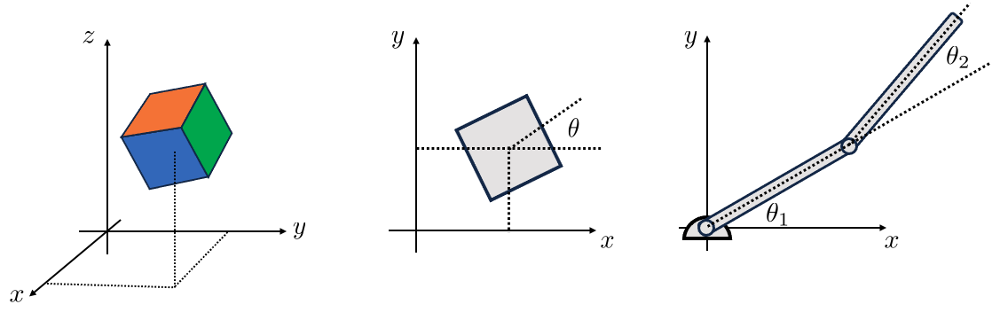
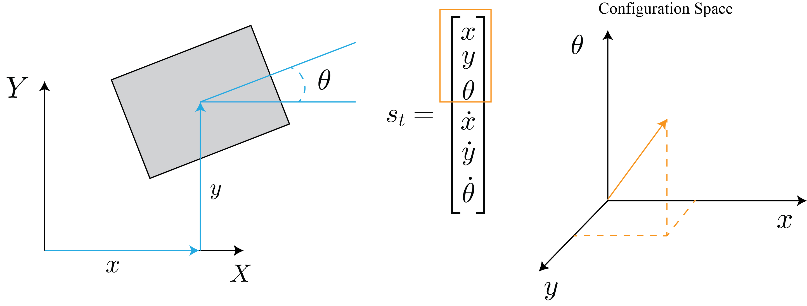
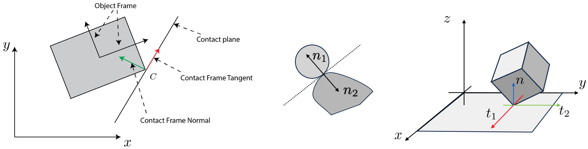
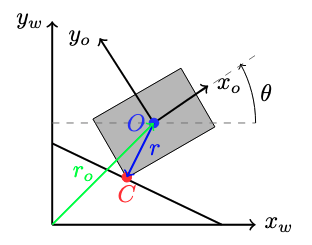
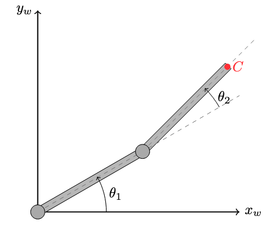
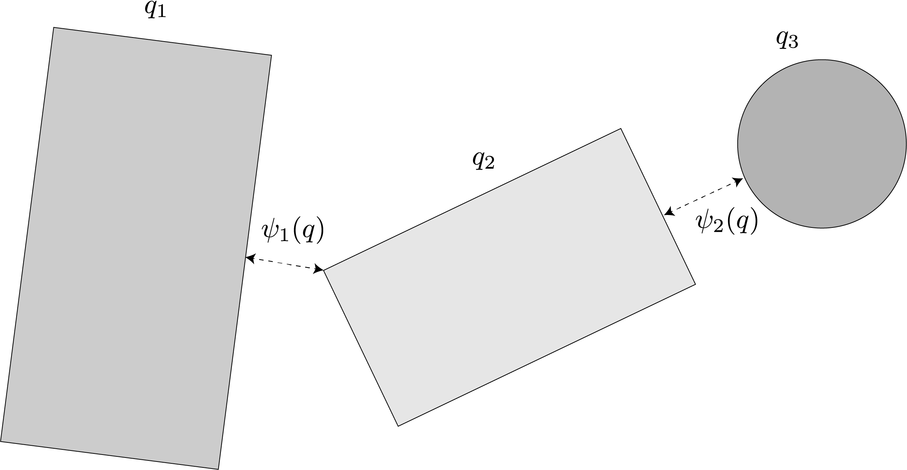
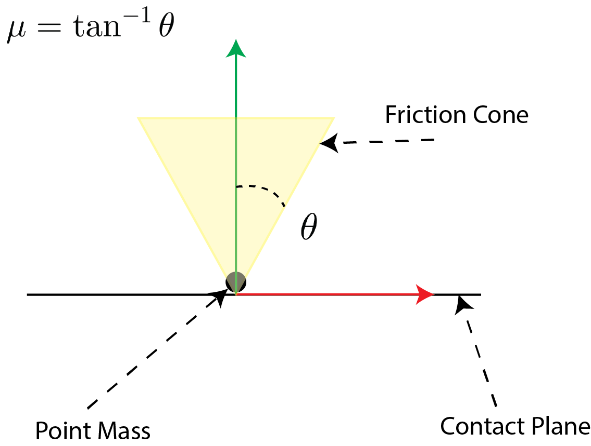
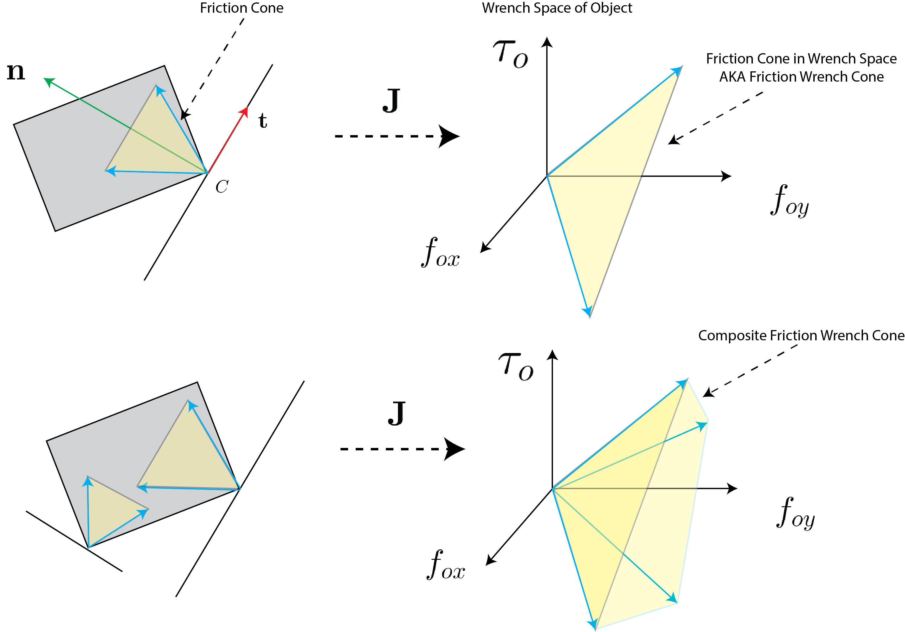
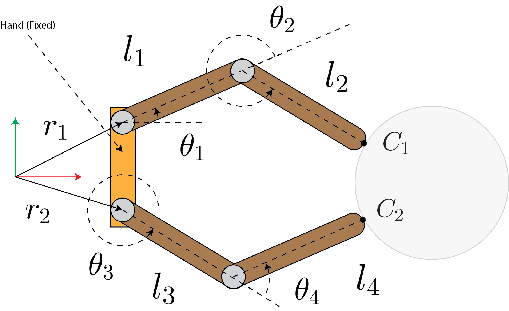

The central focus of Robotic Manipulation is the physical interaction between the robot and its environment. 
At its core, manipulation requires some form of physical contact. There are two questions every robot must answer 
when reasoning about manipulation: "what happens when I make contact with my environment?" and "how do I choose 
actions (e.g., contacts and forces) that lead to desired outcomes?". These question hint at a foundational need 
for understanding and prediction. The role of contact models is exactly to address these question, i.e. predicting 
the outcome of the physical interactions and guiding action choices. 

The field of contact modeling is too broad for our introductory discussion on robotic manipulation. Instead, 
here we'll focus on the most foundational case, that of rigid-body mechanics governed by Coulomb friction. 
Understanding this class of contact models will give you the tools to understand and master more sophisticated models. 
In this chapter, we will cover the basic mechanics using three three important manipulation problems as case studies: 
grasping, pushing, and bouncing. Before discussing these problems, we will first provide common definitions and develop 
mathematical machinery useful for our discussions. 

# Assumptions and Preliminaries

In this section, our objective is to specify the set of assumption we will use in our analyses, define some common 
terms, and develop mathematical machinery useful for our discussion on the mechanics of manipulation. For this section, 
you'll need familiarity with linear algebra. 

## Rigid-Body Mechanics

Our first major assumption is rigid-body mechanics. A rigid-body is one that undergoes no deformation at any point in 
time and space. In other words, the object does not change shape or vibrate. There are a number of interesting and 
important implications to this assumption. First, energy is not dissipated through relative particle motion (e.g., 
vibration/sound) or heat. Further, a point contact will remain a point contact. This is a relatively subtle but important 
point. Consider a compliant object such as a spatula being brought into contact with the environment. At first, the 
contact is a point or perhaps a line. As we push the spatula into the environment, it deforms, creating a contact patch. 
This deformation and change in contact formation is very complicated and the topic of current research. The rigid-body 
assumption allows us to simplify our analysis by neglecting this effect.

The rigid-body assumption is very convenient in that it allows us to represent the position of a planar body with 3 
numbers (2 for position and 1 for orientation), and 6 numbers in 3D space (more on this shortly); however, we must 
remember that it is an assumption and in practice all objects deform to some extent. Rigid-body dynamics are a 
relatively good approximation for stiff bodies that move slowly (small velocity and acceleration). Examples of these 
types of objects are surprisingly common in our day to day lives (e.g., pens, cellphones, mugs, etc.). Note that there 
are also plenty of objects that are not ``rigid'' in this sense and that scale certainly has a role to play. It is 
unlikely that 1-Dimensional objects (e.g., bristles of a brush that have only one major length factor) or 2-Dimensional 
objects (e.g., shells or sheets of paper with only two major length factors) would be well-represented as rigid-objects in general.

## Non-penetration

For most of this chapter, we will assume that no two bodies intersect each other at any point in time -- a.k.a. 
non-penetration constraint. This assumption implies that the velocity of the contact points between two objects 
cannot point towards each other. We will make extensive use of this assumption in writing constraints for contact. 
We will define distance functions to precisely quantify this notion in the Grasp Analysis subsection. We will also 
discuss methods to relax the non-penetration constraint that allows smoothing of the contact interaction. Smooth 
contact models enable a number of features including passing gradients through the contact event, smooth dynamics 
that are easier and much faster to solve, and approximations to patch contacts. However, there are also a number 
of shortcomings that we'll also discuss.

It is important to acknowledge that in the real world, verifying/detecting the non-penetration assumption is quite 
difficult due to sensor uncertainty, object geometry uncertainty, and environmental uncertainties. To address this 
limitation, advanced models and algorithms take into account these uncertainties to mitigate state-estimation and 
predictions that would lead to violation of physical constraints. These models often incorporate compliance, friction, 
and other contact-specific parameters to realistically simulate the behavior of objects during contact and to prevent 
physically implausible scenarios. We will mostly be ignoring these effects in our introductory notes.

## State and Configuration Space

State is our way of describing everything we need to know about a system to predict it's evolution over time. 
Any single rigid-body in 3D space (far from contact) has 6 degrees of freedom, 3 linear and 3 rotational, left panel 
of Fig. 1. The state vector of this body is composed of its positions and velocities. 
The state vector can be represented using at least a 12 dimensional vector, with higher dimensional (e.g., 13D) representations 
offering a number of advantages -- more on this later. This compact representation is a very nice feature of the 
rigid-body assumption.

<figure>

  

<figcaption> <b>Fig. 1:</b> Illustrative examples of rigid-bodies and their configurations. <b>Left Panel:</b> The 
  position of a general rigid-object in 3D space (our world) can be specified using 6 numbers with respect to some 
  inertial reference frame. <b>Middle Panel:</b> The same object, now constrained to move in the 2D plane needs 
  3 degrees of freedom. The planar motion is in fact 3 constraints: out of plane motion and out of plane 
  rotations are zero too. <b>Right Panel:</b> Two link manipulator example. In general, 2 rigid-objects in the 
  plane are described by 6 numbers (3 each). However, as noted in the text, the revolute joints trims down the 
  requirement to just two numbers for relative orientations. <b>A fun aside:</b> This discussion assumes that the 
  rigid-bodies occupy Euclidean 3D space. Our current understanding is that the fabric of space-time is not Euclidean 
  and has curves. The effects of space-time curvature are negligible at the scale of manipulation tasks we consider.
</figcaption>
</figure>

If we constrain the body to the plane and force it to move along a single linear axis, we'd get a system such as the 
classical 1 dimensional mass-spring-damper system which has 2 states: position of the mass and the velocity of the mass. 
This example should provide you with the following insight: for each kinematic constraint we add, we usually remove 1 
degree of freedom which results in a reduction of the state space dimensionality by 2 (the velocity term is also removed). 
For a more complex example, consider a planar 2-link pendulum, right panel of Fig. 1. In 
the absence of any constraints, this system has 24 state s $(12 \times 2)$ bodies in 3D space. By constraining to the plane, 
we have removed a total of 6 degrees of freedom (1 linear and 2 rotational per object). The revolute joints between the 
ground and the first body, and the first and second body also remove 2 degrees of freedom each. In total, the constraints 
have removed 10 degrees of freedom, leaving just 2 degrees ($\theta_1, \theta_2$) resulting in a 4 dimensional state-space. 
We usually represent state with a vector of real numbers and here denote it as $\mathbf{s}_t \in \mathbb{R}^n$. 

Configuration space is a subset of state space that describes the positions of a system **\cite{lozano1990spatial}**. Fig. 2 
depicts a 2D block in the world frame and its corresponding representation in configuration space. 
Configuration space is an important concept in robotics and is frequently used to describe not only the position of objects, 
but the set of admissible configurations objects are allowed to occupy. More on this later in the course.

<figure>

  

<figcaption> 
  <b>Fig. 2:</b> Visualization of state and configuration space for an object in 2D.
</figcaption>
</figure>

## Contact Frames and Planes

<figure>

  

<figcaption> 
  <b>Fig. 3:</b> Reference frames and the contact plane.
</figcaption>
</figure>

Consider the object depicted in the left pane of Fig. 3. We will refer to the reference frame 
attached to it's center of mass (COM) as the object frame. Let's assume that the object makes contact at point $C$ with 
some other object. We define the contact plane as the plane tangent to both objects, with an example shown in the middle 
pane of Fig. 3.  We define the contact frame at point $C$ with the following orthogonal axes: 

* the contact normal $\mathbf{n}$ is specified by the unit vector orthogonal to the contact plane -- the plane passing
  through the contact frame point tangent to the contacting bodies,
* the tangent vector $\mathbf{t}$ lies in the contact plane. In the 2D case, such as the one visualized in left
  pane of Fig. 3, it is convention to choose $\mathbf{t}$ such that its cross product into
  $\mathbf{n}$ points out of the plane towards us. In 3D, there are always 2 orthogonal tangent vectors and their
  choice is somewhat arbitrary, right panel of Fig. 3. It is common to choose them such that
  they either lie along the world frame coordinates or such that they simplify approximations to the contact
  friction cone (more on this later).

## Force Transmissions and the Contact Jacobian

Let's assume that a force is applied at $C$ to the object depicted in Fig. 3. In the vast 
majority of our discussion, this force will be due to contact (e.g., from a finger or the environment). Our goal 
is to map this force into the __wrench__ space of the object. For the block, we can think of the wrench space 
as the composition of the forces (linear) and torque the object would experience at the Center of Mass (COM) frame. 
While externally applied forces may or may not have torque components, the resulting object wrench is composed of 
both forces and torques in general. The motivation for mapping forces into the wrench space of the system is that 
the contribution of multiple forces can be summed up to predict the future states of the system.

We will derive the mapping between the externally applied force at $C$ to the wrench space of the object in two ways. 
The first approach will be a direct mapping using our knowledge of linear algebra. The second approach leverages 
the classical notion of Jacobians and relations between velocities. The first approach is effective for simple systems 
and for providing intuition, while the second approach generalizes much more easily and is easier to implement in code.

**Approach 1:** Let's derive an example of the contact Jacobian for Fig. 3. To start, we assume that we have applied a 
linear external force at point $C$. This force is represented in the object frame as:

$$
\mathbf{f}_c =  f_t \mathbf{t} + f_n \mathbf{n} = \begin{bmatrix} n_y \\ -n_x \end{bmatrix} f_t + \begin{bmatrix} n_x \\ n_y \end{bmatrix} f_n = 
 \begin{bmatrix} n_y & n_x \\ -n_x & n_y \end{bmatrix} \begin{bmatrix} f_t \\ f_n \end{bmatrix}
$$
 
where we write the unit normal vector in the object frame as $\mathbf{n} = (n_x, n_y)$ where the subscripts specify 
the projection of the vector along the object reference frame axes. Note that we have used the orthogonality of $\mathbf{n}$ and 
$\mathbf{t}$ to re-write $\mathbf{t}$. The first component represents the tangential force along the unit tangent vector and 
the second represents the normal force along the unit normal vector. Next, let's denote the vector pointing from the COM to 
the contact point with $\mathbf{r} = (r_x, r_y)$ in the object frame. To compute the effect of this force at the COM we write:

$$
\begin{aligned}
    \mathbf{w}_{n} = \begin{bmatrix}  \mathbf{n} \\  \mathbf{r} \times \mathbf{n} \end{bmatrix} f_n = \begin{bmatrix}  n_x \\ n_y \\  r_xn_y - r_yn_x  \end{bmatrix} f_n 
\end{aligned}
$$

where the first two terms are the effect of the linear force translated to the COM and the last term accounts for 
the moment induced by the force at a distance w.r.t. to the COM. Similarly, the effect of a tangent force of magnitude 
$f_t$ at the COM is:

$$
\begin{aligned}
    \mathbf{w}_{t} = \begin{bmatrix}  n_y \\ -n_x \\ -r_x n_x - r_y n_y  \end{bmatrix} f_t
\end{aligned}
$$

To find the total wrench applied to the COM, we simply consolidate the previous two expressions and write:

$$
\begin{align*}
    \mathbf{w} = \begin{bmatrix}  n_y & n_x \\ -n_x & n_y \\ -r_x n_x - r_y n_y & r_x n_y - r_y n_x \end{bmatrix} \mathbf{f}_c = \mathrm{J}_c \mathbf{f}_c
\end{align*}
$$

where $\mathrm{J}_c$ is called the contact Jacobian and is responsible for mapping the reaction force expressed 
in the contact frame to the force applied to the object in it's configuration space. The contact Jacobian is an 
important concept we will revisit consistently in the remainder of these notes.

**Approach 2:** Classically, a Jacobian in mathematics is the matrix you'd get if you took the gradient of a 
vector-valued function with respect to its arguments. To illustrate, assume that 
$\mathbf{x} \in \mathbb{R}^n$ and $\mathbf{y} \in \mathbb{R}^m$. Let's assume these vectors are related by a function $f$, 
then the Jacobian is:

$$
\begin{align*}
    \mathbf{y} = f(\mathbf{x}) \; \rightarrow \quad \frac{\partial \mathbf y}{\partial \mathbf x} = \mathrm{J} = \begin{bmatrix} \frac{\partial y_1}{\partial x_1} & \cdot & \frac{\partial y_1}{\partial x_n} \\ \vdots & \ddots & \vdots \\ \frac{\partial y_m}{\partial x_1} & \cdots & \frac{\partial y_m}{\partial x_n} \end{bmatrix}
\end{align*}
$$

You may be starting to wonder how this relates  to mapping forces to the COM. We're going to show that the 
transpose of the Jacobian mapping robot velocities to Cartesian velocities relates external forces to the COM. 
To see this, consider the block visualized in Fig.~\ref{fig:tikz-block} and note that the position of point $C$ 
(denoted by $\mathbf{r}_c$) can be represented by the sum of $\mathbf{r}_o+\mathbf{r}$. Let's write this as a function:

$$
\begin{align*}
    \mathbf{r}_c(\mathbf{q})= f(\mathbf{q}) = \mathbf{r}_o+\mathbf{r} 
\end{align*}
$$

where $\mathbf{q}=(x,y,\theta)$ represents the pose of the object with respect to the origin of the world frame. 
We can take the time derivative of this expression to compute the velocity of point $C$:

$$
\begin{align}
    \mathbf{v}_c = \frac{d\mathbf{r}_c(\mathbf{q})}{dt} = \frac{\partial \mathbf{r}_c(\mathbf{q})}{\partial \mathbf{q}} \frac{d \mathbf{q}}{dt} = \mathrm{J} \dot{\mathbf{q}} = \begin{bmatrix} 1 & 0 & -r_y \\ 0 & 1 & r_x \end{bmatrix}  \dot{\mathbf{q}}
\end{align}
$$

where $\mathbf{r}=(r_x, r_y)$ is defined just as approach 1. Here, the Jacobian maps the object __twist__
$\dot{\mathbf{q}} \in \mathbb{R}^3$ (the object's linear and rotational velocities) to the contact point linear 
velocity $\mathbf{v_c}\in \mathbb{R}^2$. To understand/derive the final column, consider the velocity of point $C$ 
when the object undergoes pure rotation about point $O$, the top row is the projection of the velocity vector 
along $x_w$ and the bottom is for $y_w$. 

<figure>

  

<figcaption> 
  <b>Fig. 4:</b> The pose of the object with respect to the world reference frame is $\mathbf{q}=(x,y,\theta)$. 
  The contact point is denoted by $C$. The vectors $\mathbf{r}_o$ and $\mathbf{r}$ point from the origin to the 
  COM and from the COM to the contact point, respectively.
</figcaption>
</figure>

Now we make use of the fact that energy (and consequently power) is conserved. If we apply some force 
$\mathbf{f}_c$ at point $C$ (represented in the object frame just as approach 1), it will result in a wrench 
at the COM $\mathbf{w}_o$. The total power provided by the applied force and resulting object wrench must be equal so we can write:

$$
\begin{align*}
    \mathbf{w}_o \cdot \dot{\mathbf{q}} = \mathbf{f}_c \cdot \mathbf{v}_c  
\end{align*}
$$

Now recall that we already derived a relationship between object twist and the velocity of $C$, so we may write:

$$
\begin{align*}
    \mathbf{w}_o \cdot \dot{\mathbf{q}} = \mathbf{f}_c \cdot (\mathrm{J}\dot{\mathbf{q}}) \quad \rightarrow \quad \dot{\mathbf{q}}^T \mathbf{w}_o  = \dot{\mathbf{q}}^T\mathrm{J}^T \mathbf{f}_c
\end{align*}
$$

Since this relationship must hold for all values of $\dot{\mathbf{q}}$, then we can simplify to:

$$
\begin{align*}
    \mathbf{w}_o  = \mathrm{J}^T\mathbf{f}_c = \begin{bmatrix} 1 & 0  \\ 0 & 1 \\ -r_y & r_x \end{bmatrix}  \begin{bmatrix} n_y & n_x \\ -n_x & n_y \end{bmatrix}\mathbf{f}_c =
    \begin{bmatrix}  n_y & n_x \\ -n_x & n_y \\ -r_x n_x - r_y n_y & r_x n_y - r_y n_x \end{bmatrix} \mathbf{f}_c = \mathrm{J}_c \mathbf{f}_c
\end{align*}
$$

which you'll find is the same expression as we arrived at from approach 1.

To demonstrate the versatility of the second approach, consider the two-link manipulator shown in 
Fig.~\ref{fig:two-link-tikz}. Let's assume that an external force is applied at point $C$. Our goal is 
to project this external force into the configuration space of the arm using the contact Jacobian. To compute 
the contact Jacobian, we write the forward kinematics (location of point $C$ written as a function of the 
configuration of the arm) and compute the gradient w.r.t. the arm configurations:

$$
\begin{align*}
    \mathbf{r}_c = f(\mathbf{q}) = \begin{bmatrix} l_1 \cos{\theta_1} & l_1 \cos{\theta_1} + l_2 \cos{(\theta_1+\theta_2)} \\ 
    l_1 \sin{\theta_1} & l_1 \sin{\theta_1} + l_2 \sin{(\theta_1+\theta_2)}
    \end{bmatrix} \rightarrow \quad \mathrm{J} = \frac{\partial f(\mathbf{q})}{ \partial \mathbf{q}} = \begin{bmatrix} - l_1 \sin{\theta_1} & -l_1 \sin{\theta_1} - l_2 \sin{(\theta_1+\theta_2)} \\ 
    l_1 \cos{\theta_1} & l_1 \cos{\theta_1} + l_2 \cos{(\theta_1+\theta_2)}
    \end{bmatrix}
\end{align*}
$$

Then the effective torques applied to the joints due to the external force $C$ is:

$$
\begin{align*}
    \mathbf{\tau} = \mathrm{J}^T \mathbf{f}_c = \mathrm{J}_c \mathbf{f}_c
\end{align*}
$$

where we represent $\mathbf{f}_c$ in the world frame. You may wonder: "why was $\mathbf{f}_c$ 
represented in the object frame for the block example but in the world frame for the two-link manipulator?". 
This is an astute question. One answer is to note the frame in which we write the total power:

$$
\begin{align*}
    \mathbf{\tau} \cdot \dot{\mathbf{\theta}} = \mathbf{f}_c \cdot \mathbf{v}_c
\end{align*}
$$

Since we have chosen to measure the angles and angular rotations of the arm with respect to the 
world frame, and measure the velocity of point $C$ in the world frame, then $\mathbf{f}_c$ must 
also be in the same frame for the dot product to make sense. In the previous example, we represented 
everything in the object frame. 

<figure>

  

<figcaption> 
  <b>Fig. 5:</b> A two link manipulator with an external force applied at $C$. The configuration of 
  this system is entirely determined by $\mathbf{q}=(\theta_1, \theta_2)$
</figcaption>
</figure>

Thus far in our discussion, we have not placed any constraints on the force applied through point 
$C$. However, forces due to contact must satisfy a number of constraints that we will discuss next.

## Contact Force Constraints -- Unilateral Forces Governed by Coulomb Friction

Perhaps the most fundamental contact constraint states that when two bodies come into contact, the 
resultant normal force between the objects must "push" on the objects to prevent penetration. 
This force can never pull. The implication of this constraint is that the normal component of the 
contact force $\mathbf{f}_c$ must be non-negative:

$$
\begin{align*}
    \mathbf{f}_c =  f_t \mathbf{t} + f_n \mathbf{n} \quad \text{such that} \quad f_n \geq 0
\end{align*}
$$

There is a small subtlety hidden in this constraint: we assume that $\mathbf{n}$ is pointing "into" 
the object due to the way that we defined the contact plane and the contact normal. Thus, $f_n \geq 0$ 
means pushing "into" the object. We note that this constraint alone is not the same as non-penetration. 
It is possible for two bodies to penetrate while still pushing against each other. Towards enforcing 
non-penetration, first let's denote the distance function between the two bodies with 
$\psi(\mathbf{q}) \; : \; \mathbf{q}\in \mathbb{R}^n \rightarrow \mathbb{R}$. Fig. 6 
illustrates 2 examples of distance functions between 3 objects. When $\psi >0 $ then the objects are 
not in contact, while $\psi < 0$ implies penetration. $\psi = 0$ means precise tangency of two objects 
(they are only just touching). 

<figure>

  

<figcaption> 
  <b>Fig. 6:</b> Example distance functions.
</figcaption>
</figure>

With the definition of distance functions, we can now precisely define when a force should be applied by writing:

$$
\begin{align*}
    f_n \geq 0, \quad \psi \geq 0, \quad \psi \perp f_n
\end{align*}
$$

which states that *either* the distance between the objects is greater than zero, meaning there is 
no normal force or that the distance is zero, resulting in a normal force greater than zero. These constraints 
are referred to as a *unilateral* and the specific form presented here is called the Signorini condition 
for non-penetration. We will discuss in greater detail solutions for interactions that must obey these 
constraints later in this chapter. Next, we'll turn our attention to the tangential force imparted between the objects.  

We assume that all frictional interactions are governed by Coulomb friction (a.k.a. dry friction). Coulomb 
friction is a model of the interaction force between two bodies in contact. In this model, the frictional 
force at the point of contact is proportional to the normal force between the objects. The coefficient of 
proportionality is referred to as the coefficient of friction, $\mu$. The tangential frictional force is in 
the contact plane and opposes the relative motion (or tendency of motion) between objects. If there is no 
relative motion between the objects, then the friction force takes on a value between zero and a maximum 
determined by the normal force scaled by the coefficient of friction ($ \leq \mu f_n$). If there is relative 
motion, then the frictional force is equal to the product of the normal force and the coefficient of 
friction ($ = \mu f_n$). While you may find that some texts make a distinction between the kinetic/dynamic 
coefficient of friction and its static counterpart, we will ignore this effect and assume they are the same 
for convenience. The reason for this is that most manipulation tasks operate in the quasi-static or 
quasi-dynamic regimes that are governed largely by the static coefficient of friction. 

<figure>

  

<figcaption> 
  <b>Fig. 7:</b> Point mass in frictional contact with a fixed surface.
</figcaption>
</figure>

Consider a point mass in contact with a fixed surface, as depicted in Fig. 7. We can 
represent the set of forces allowed by the Coulomb friction model as the "friction cone". This cone specifies 
the set of reaction forces applies to the object from the surface due to contact. The reaction force itself 
is the sum of the normal and tangential forces applied to the bodies. The friction cone has the following important properties:

- The cone axis is perpendicular to the surface of contact (parallel to the surface's normal),
- The cone sides make an angle of $\theta = \text{tan}^{-1} \mu$ with the axis.

Let's assume the point mass is stationary, if we apply an external force that lies within the friction cone 
then it is cancelled by the reaction force. A more precise mathematical statement regarding "lies within 
the friction cone" is to say that if we can find a positive combination of vectors that span the cone such 
that the sum of the external force and the positive span is a zero vector, then the external force lies within 
the friction cone. This statement means that friction due from the interaction can resist any force within the 
friction cone -- which means that the object does not accelerate, implying that it is in sticking contact. 

If we apply an external force that does not lie within the friction cone, then the reaction force can only 
partially resist it, and the remaining external force imparts an acceleration to the object. This implies that 
the object moves, either in sliding contact or separation. If the point mass has some initial velocity tangential 
to the surface, then the reaction force is always on the boundary of the cone and in the direction opposing the 
relative tangential velocity. This is due to the principle of maximal dissipation, a concept we'll cover later in 
the notes. Our introduction to the friction cone is for a point mass/point contact model. We will extend these 
ideas to patch contacts in subsequent sections of the notes.

Consider the extended body depicted in Fig. 8. The friction cone is depicted at the point 
of contact $C$. The friction cone is the set of all possible reaction forces that can be imparted to the object 
through frictional interaction. This means that we can use the contact Jacobian to project the friction cone 
into the wrench space of the object -- referred to as the wrench space friction cone (or the wrench cone for short). 
We may sum up the effect of multiple contacts projected to the wrench space -- referred to as the composite 
wrench space friction cone (composite wrench cone for short). 

<figure>

  

<figcaption> 
  <b>Fig. 8:</b> Friction cone for the extended body and it's projection into the object wrench space -- resulting in the composite friction wrench cone.
</figcaption>
</figure>

## Robot/Finger Jacobians

The Jacobian we described in the previous subsection can be extended to handle multi-link fingers. 
Consider the hand depicted in Fig. 9. This hand has two fingers each with two links 
that are actuated. We assume that these fingers make contact at points $C_1$ and $C_2$. In this subsection, 
our objective is to find the applied contact force given the torques supplied to the joints of the fingers. 
Recalling from the previous subsection discussion on the Jacobians, we'll use the duality between configuration 
space velocity and contact points velocity to the derive this Jacobian.

<figure>

  

<figcaption> 
  <b>Fig. 9:</b> Fingers of a robot with contact points $C_1$ and $C_2$.cone.
</figcaption>
</figure>

Our first step is to relate the joint angles to the contact point locations $C_1$ and $C_2$ in the fixed 
hand reference frame. This procedure is referred to as forward kinematics. Let's denote the location of the 
contact points $C_1$ and $C_2$ as $\mathbf{q}_c$. We may write:

$$
\begin{align*}
    \mathbf{q}_c = \begin{bmatrix} x_{c1} \\ y_{c1} \\ x_{c2} \\ y_{c2} \end{bmatrix} = fk(\mathbf{\theta}) =  \begin{bmatrix} l_1c_1 + l_2 c_{12} + r_{1,x} \\ l_1s_1 + l_2 s_{12} + r_{1,y} \\ l_3c_3 + l_4 c_{34} + r_{2,x} \\ l_3s_3 + l_4 s_{34} + r_{2,y} \end{bmatrix}
\end{align*}
$$

where $\mathbf{\theta} = [\theta_1, \theta_2, \theta_3, \theta_4]^T$, $s_i = \sin(\theta_i)$, 
$c_i = \cos(\theta_i)$, $s_{ij} = \sin(\theta_i + \theta_j)$, and $c_{ij} = \cos(\theta_i + \theta_j)$. 
We can calculate the contact point velocity by taking the derivative of this expression w.r.t. to time:

$$
\begin{align*}
    \dot{\mathbf{q}}_c = \frac{\partial fk(\mathbf{\theta})}{\partial \mathbf{\theta}}\dot{\mathbf{\theta}} = \begin{bmatrix} -l_1s_1-l_2s_{12} & -l_2s_{12} & 0 & 0 \\
    l_1c_1+l_2c_{12} & l_2c_{12} & 0 & 0 \\
    0 & 0 & -l_3s_3-l_4s_{34} & -l_4s_{34} \\
    0 & 0 & l_3s_3+l_4s_{34} & l_4c_{34}
    \end{bmatrix} \dot{\mathbf{\theta}} = \mathrm{J}^T_f \dot{\mathbf{\theta}} 
\end{align*}
$$

Before applying the duality between force-wrench and velocities, we take a moment to justify it. 
First, we note that the total amount of power/energy in our system must be conserved. The total amount 
of power the fingers can exert is:

$$
\begin{align*}
    P_f = \mathbf{\tau}^T \dot{\mathbf{\theta}}
\end{align*}
$$

where $\mathbf{\tau}$ denotes the joint torques. The total power exerted at the contact points 
by the externally applied forces is equal to:

$$
\begin{align*}
    P_c = \mathbf{f}^T_c \dot{\mathbf{q}}_c
\end{align*}
$$

Since the input power has to equal the output power, we write:

$$
\begin{align*}
    \mathbf{\tau}^T \dot{\mathbf{\theta}} = \mathbf{f}^T_c \dot{\mathbf{q}}_c
\end{align*}
$$

now replacing the relationship we just derived for the Jacobian:

$$
\begin{align*}
    \mathbf{\tau}^T \dot{\mathbf{\theta}} = \mathbf{f}^T_c \mathrm{J}^T_f  \dot{\mathbf{\theta}}
\end{align*}
$$

and since this relationship has to hold for all values of $\dot{\mathbf{\theta}}$ then we can conclude that:

$$
\begin{align*}
    \mathbf{\tau} =  \mathrm{J}_f  \mathbf{f}_c
\end{align*}
$$

This summarizes the application of the duality and derives a relationship between the joint torques and the amount of force produced at the contact points.
