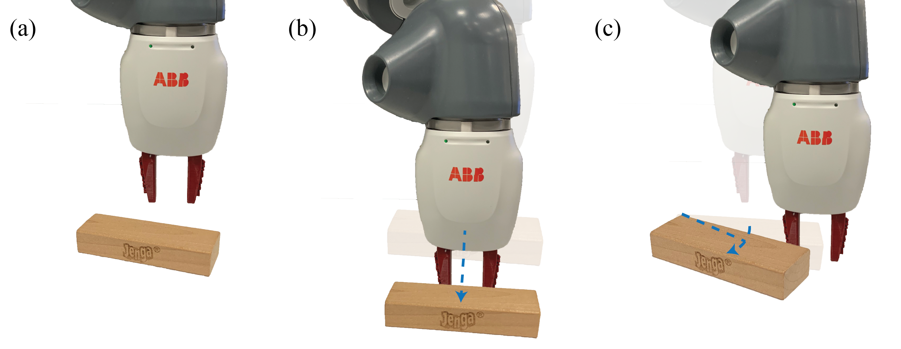
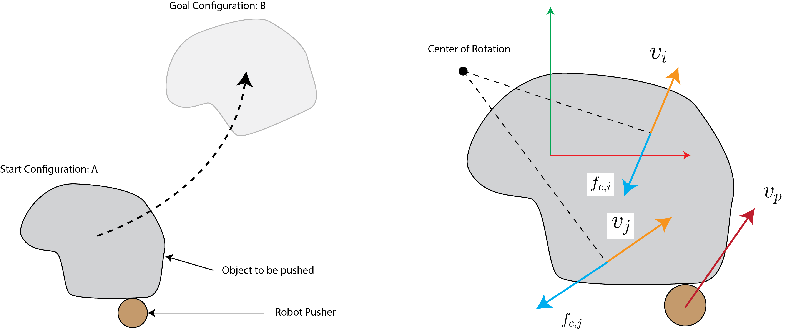
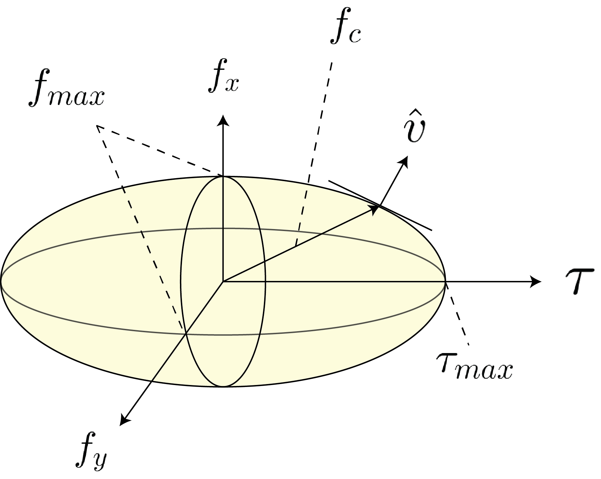
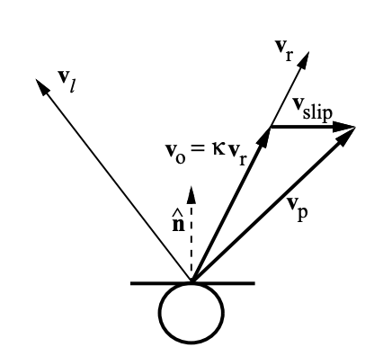
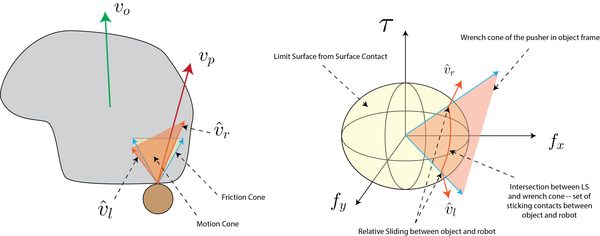
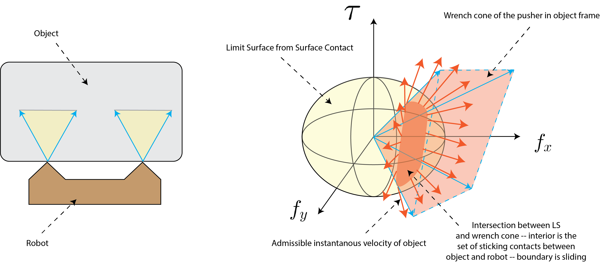

## Planar Pushing

In the previous section, we covered a dynamics analysis of rigid-bodies undergoing 
frictional interaction. In this section, we will cover another important type of rigid 
body frictional interaction where acceleration does not play an important role -- the quasi-static 
regime. The intuition behind this regime is that motion is allowed but slowly enough such that 
accelerations terms such as inertial, centrifugal, and Coriolis are negligible. This assumption 
significantly simplifies the equations of the equations of motion and holds for many types of 
manipulation behaviors such as grasping and insertion.

Here, we focus on pushing, an important manipulation primitive, as a canonical example of a behavior 
that is well approximated by the quasi-dynamic assumption. See Fig.~\ref{fig:yummy-push} for an 
example of this manipulation primitive. A key insight here is that if we stop pushing the object, 
it will stop moving because of negligible acceleration. We note that pushing can also be studied under 
the dynamics formulation; however, most pushing interactions are relatively slow and are well 
approximated by quasi-statics. 

<figure>

  

<figcaption> 
  <b>Fig. 1:</b> Illustrative example of planar pushing with a robot and a Jenga block.
</figcaption>
</figure>

The quasi-static assumption in planar pushing has a long and rich history and we point the 
interested reader to some of the seminal work 
by \citet{Mason-pushing,Mason-1986-15649, goyal1991planar,lynch1992mechanics,lynch1996stable,lynch1996nonprehensile,howe1996practical}, 
among many, for further details.

### The Quasi-Static Assumption

Recall from the previous session that the dynamic equations of motion can be written as:

$$
\begin{align*}
    \mathrm{M}(\mathbf{q})\dot{\mathbf{v}} + \mathbf{c}(\mathbf{q}, \mathbf{v}) + \mathbf{g}(\mathbf{q}) = \mathbf{f}_{e} + \mathbf{f}_c
\end{align*}
$$

where the two terms on the right hand side denote the external and contact forces. Under our 
quasi-static assumption we made simplify this expression to:

$$
\begin{align*}
    \dot{\mathbf{q}} + \mathbf{g}(\mathbf{q}) = \mathbf{f}_{e} + \mathbf{f}_c
\end{align*}
$$

where we have neglected the inertial, centrifugal, and Coriolis acceleration terms. The net 
change in configuration of the object is determined by the balance between external and contact forces. 
Intuitively, if you move something, then let it go, it stops moving, i.e. motion is possible but propensity
for motion is not. **An important interpretation of the quasi-static assumption is that the change in 
configuration and the net applied forces must be consistent. We think less of force as causing a change 
in configuration and more as the change in configuration being consistent with the applied and reaction forces.**

Examples of tasks that are common in manipulation for which this assumption holds include grasping, 
pushing, and peg insertion. These tasks are typically executed slowly enough such that 
acceleration terms base safety be neglected. 

### Single Finger Pushing

Consider the task depicted in the left panel of Fig.~\ref{fig:chap1:slider}. The objective is 
to move the object from point a to point B. One effective method of executing this task is to 
push the object along the trajectory connecting these two points. Pushing is particularly useful 
when the robot lacks the strength or is impeded by obstacles that prevent it from grasping/lift 
the object.

In this section, we're going to assume that the robot is only able to push the object with one finger. 
From the perspective of the object, there are two external forces: The first is the force applied 
by the robot through to finger (frictional single point contact), and the second is the frictional 
force from the contact between the object and the ground. The key observation here is that the frictional 
force exerted by the ground is of a different nature than the point contacts we've studied so far. 

To handle this nuance, we will discuss a useful mathematical tool, referred to as the Limit 
Surface (LS). We will continue to assume that all bodies are rigid and Coulomb friction holds. We 
will further assume that the mass distribution across the contact patch is uniform. We also note that 
for the object to move it must slide across the surface; however, the contact between the finger 
and the block may stick or slide. 

### The Limit Surface and its Ellipsoidal Approximation

In this section, our objective is to find a mapping between the robot push action and the 
resulting object motion. From our quasi-static assumption, we know that the resultant motion 
of the object is due to the balance between the external force applied by the robot and the ground 
friction force. Here, we derive the Limit Surface (LS), a useful mathematical abstraction that 
we will use to relate robot action and motion to the resulting object motion by solving for this 
balance. Our derivation follows the work of \citet{lynch1992manipulation} and \citet{howe1996practical} 
closely and we refer the interested reader to these excellent texts for further details.

<figure>

  

<figcaption> 
  <b>Fig. 2:</b> Pusher-slider system with initial and goal configurations. Here we 
  see that the friction force at any point on the ``support surface'' 
  opposes the direction of motion at that point. This is due to the principle 
  of Maximal Dissipation -- see \citet{goyal1991planar} for more details.
</figcaption>
</figure>

Consider Fig.~\ref{fig:chap1:slider}. As the robot pushes the object, every point on the 
support surface (interface between the object and the surface it is moving on) 
resists the resulting motion due to Coulomb friction. The limit surface is the sum 
of all these forces on the support surface. It is the analog of the friction cone for 
a patch contact. We may write this sum as:

$$
\begin{align*}
    \mathbf{f}_c & = \int_{S} \frac{\mathbf{v}(\mathbf{x})}{|\mathbf{v}(\mathbf{x}))|} \; \mu p \;  d\mathbf{x} = \int_{S} \hat{\mathbf{v}}(\mathbf{x}) \; \mu p \;  dA \\
    \mathbf{\tau}_c & = \int_{S} \mathbf{x} \times \frac{\mathbf{v}(\mathbf{x})}{|\mathbf{v}(\mathbf{x}))|} \; \mu p \;  d\mathbf{x} = \int_{S} \mathbf{x} \times \hat{\mathbf{v}}(\mathbf{x}) \; \mu p \;  dA
\end{align*}
$$

where $\mathbf{v}$ denotes the velocity at point $\mathbf{x}$ on the support surface, $\mu$ is 
the coefficient of friction, and $p$ is the pressure at point $\mathbf{x}$ (here a constant 
because of our uniform pressure distribution assumption). We can calculate $\mathbf{v}(\mathbf{x})$ 
using rigid-body mechanics as:

$$
\begin{align*}
    \mathbf{v}(\mathbf{x}) = \begin{bmatrix} v_x - \omega y \\ v_y + \omega x \\ 0 \end{bmatrix}
\end{align*}
$$

where $\dot{\mathbf{q}} = \mathbf{v} = (v_x, v_y, \omega)^T$ is the velocity vector of the 
object and $\mathbf{x} = (x,y,0)^T$ is the coordinate of every point on the surface relative to 
the center of mass. This function defines the Limit Surface and maps the unit velocity vector 
of the object to the reaction force from the support. Under the relatively easy to satisfy 
assumption that the pressure at every point on the support surface is finite, this function 
is smooth and strictly convex (one-to-one). If we solve for every unit velocity vector of 
the object, we have a surface (the Limit Surface) defined in force-torque space (wrench space) 
that maps every possible motion of the object to its corresponding frictional reaction force. 
Fig.~\ref{fig:chap1:ls} illustrates an ellipsoidal LS. \citet{goyal1991planar} show that the unit
vector $\hat{\mathbf{v}}$ is orthogonal to the Limit Surface. Intuitively, we are integrating 
over a gradient field $\hat{\mathbf{v}}$ to derive the surface, so the field must be orthogonal 
to the surface at all points.

<figure>

  

<figcaption> 
  <b>Fig. 3:</b> Ellipsoidal Limit Surface.
</figcaption>
</figure>

To recap, if the object moves we can calculate the resistive frictional force using the LS -- 
the reaction force lies on the boundary of the limit surface (similar to the point contact case 
where the force would lie on the boundary of the friction cone). The object motion is orthogonal 
to the surface of the LS. Further, if the net external force does not exceed the friction force for 
any choice of object motion, then the object does not move -- the reaction force is in the interior of the LS.

It is only possible to solve for the limit surface in closed form for very few geometries. 
This complicates its use for controls and planning. To alleviate this 
challenge \citet{howe1996practical,lynch1992manipulation} proposed an ellipsoidal 
approximation to the surface that can easily be constructed. \citet{lynch1992manipulation} 
proposes the following three steps to construct the ellipsoidal approximation of the LS:

- Calculate the maximum torsional friction that the surface can resist using
  
$$
\tau_{max} = \mu \; p \int_{S} |x|   dA
$$

- Calculate the maximum linear frictional force that the surface can resist using:
  
$$
f_{max} = \mu |\mathbf{f}_n|
$$

where $|\mathbf{f}_n|$ denotes the normal force.
- Approximate the ellipsoidal surface is given by:

$$
 \left( \frac{f_x}{f_{max}}\right)^2 + \left( \frac{f_y}{f_{max}}\right)^2 + \left( \frac{\tau}{\tau_{max}}\right)^2 = 1
$$

\citet{howe1996practical} Show that this approximation is close to 
the analytical solution in a variety of empirical experiments. An important note 
to be made is that the LS is scaled by the coefficient of friction, it grows 
as $\mu$ increases.

### Equations of Motion

So far we have studied the effects of fresh orientation forces and object motion. 
We have yet to relate the robot action to the object motion. In the section, we 
develop procedures to relate robot actions to resulting object motion under two 
scenarios: first, The robot is able to impart forces to the object directly (force-controlled); 
and second, the robot is position controlled and can only import displacements. In both scenarios, 
we assume that the robot moves slowly enough such that the quasi-static assumption holds (no accelerations).

---

**Force-control:** Given an external force $\mathbf{f}_e = (f_x, f_y)$ applied at contact point $\mathbf{x}_c = (x, y)$:

_Step 1:_ Compute the effect of the external force at the COM. We can use the contact Jacobian 
we derived in previous sections to map the force at the point of contact between the robot and object:

$$
\begin{align*}
   \mathbf{f}_{e,c} = \mathbf{J}_c \mathbf{f}_e
\end{align*}
$$

_Step 2:_ This force is equal and opposite to the reaction force applied by the support surface:

$$
\begin{align*}
    \mathbf{f}_{e,c} = - \mathbf{f}_{c}
\end{align*}
$$
So we find the corresponding point on the limit surface.

_Step 3:_ Compute the normal to the LS, denoted as $\hat{\mathbf{v}}$, and update the configuration of the object according to:

$$
\begin{align*}
    \mathbf{q}_{t+1} = \mathbf{q}_{t} + h \hat{\mathbf{v}}
\end{align*}
$$

where $h$ denotes the step size. The smaller the value, the better the approximation.

---

**Position-control** The central challenge in predicting the motion of the 
object due to changes in position of the robot (rather than force applied by the robot) 
is to project the robot motion into the force domain. \citet{Mason-pushing} developed 
a principle approach for planar pushing using the notion of \textit{motion cones} 
which \citet{lynch1992manipulation} applied to the ellipsoidal approximation of the LS. 
Here, we follow this approach:

 <em>Step 1:</em> Denote the point of contact in the object frame as $\mathbf{x}_c = (x_c, y_c)$,
 the robot pusher velocity as $\mathbf{v}_p = (v_{p,x}, v_{p,y})$, and the object velocity 
 at the point as $\mathbf{v}_o = (v_{o,x}, v_{o,y})$ as illustrated in 
  Fig.~\ref{fig:chap1:single-finger}.

  <em>Step 2:</em> Compute the unit velocities $\hat{\mathbf{v}}_l = (v_{l,x},v_{l,y},v_{l,\omega})$ 
  and $\hat{\mathbf{v}}_r= (v_{r,x},v_{r,y},v_{r,\omega})$ resulting from forces at the 
  left and right extremes of the friction cone. The corresponding velocities at the contact point are 
  $\hat{\mathbf{v}}_{c,l} = (v_{l,x} - y_c v_{l,\omega}, v_{l,y} + x_c v_{l,\omega})$ 
  and $\hat{\mathbf{v}}_{c,r} = (v_{r,x} - y_c v_{r,\omega}, v_{r,y} + x_c v_{r,\omega})$. These 
  two vectors define the \textit{motion cone} \citet{Mason-pushing}. Any force applied at the point 
  of contact within the friction cone results in a velocity that is within the motion cone, i.e. it 
  can be written as the positive sum of $\hat{\mathbf{v}}_{c,r}$ and $\hat{\mathbf{v}}_{c,l}$.

_Step 3:_ If the pusher velocity is within the motion cone, then the contact is sticking 
and $\mathbf{v}_o = \mathbf{v}_p$. If the pusher velocity is to the left (right) of the motion cone, 
then the pusher slides on the object to the left (right).

_Step 4:_ If the contact is sticking, we know that $\mathbf{v}_o = \mathbf{v}_p$. Since the 
applied force must pass through the point of contact and $\mathbf{\tau}=\mathbf{x}_c \times \mathbf{f}_c$, we may write:

$$
\begin{align*}
    v_x &= v_{p,x} + v_{p,\omega}y_c \\ 
    v_y &= v_{p,y} - v_{p,\omega}x_c \\
    \tau &= x_c f_y - y_c f_x
\end{align*}
$$

Given that $\mathbf{f}$ is parallel to $\mathbf{v}$, we may write:

$$
\begin{align*}
    \frac{v_x}{v_\omega} = \left( \frac{\tau_{max}}{f_{\max}}  \right)^2 \frac{f_x}{\tau} = c^2 \frac{f_x}{\tau} \\
    \frac{v_y}{v_\omega} = \left( \frac{\tau_{max}}{f_{\max}}  \right)^2 \frac{f_y}{\tau} = c^2 \frac{f_y}{\tau}
\end{align*}
$$

and solving for the object velocity we have:

$$
\begin{align*}
    v_x & = \frac{(c^2 + x_c^2)v_{p,x}+x_c y_c v_{p,y}}{c^2 + x_c^2 + y_c^2} \\ 
    v_y & = \frac{x_c y_c v_{p,x}+ (c^2 + y_c^2) v_{p,y}}{c^2 + x_c^2 + y_c^2} \\ 
    v_\omega & = \frac{x_c v_y - y_c v_x}{c^2} 
\end{align*}
$$

_Step 5_: If the contact is sliding, i.e. when $\mathbf{v}_p$ is outside the motion cone, 
then the contact is slipping and $\mathbf{v}_o$ lies on the boundary of the motion cone. 
The slipping velocity $\mathbf{v}_s$ (in the plane of contact) satisfies:

$$
\begin{align*}
    \mathbf{v}_o + \mathbf{v}_s = \mathbf{v}_p
\end{align*}
$$

as shown in Fig.~\ref{fig:chap1:lynch-sliding}. To calculate the velocity of the object, 
we project the velocity of the pusher onto the boundary of the motion cone. Let's assume 
the sliding is to the right (same process holds for the left):

$$
\begin{align*}
    \mathbf{v}_o = \frac{\mathbf{v}^T_p \hat{\mathbf{n}}}{\mathbf{v}^T_r \hat{\mathbf{n}}} \mathbf{v}_r = \kappa \mathbf{v}_r
\end{align*}
$$

<figure>

  

<figcaption> 
  <b>Fig. 4:</b> Contact between robot and object is slipping. The resulting 
  velocities are shown. This image is from \citet{lynch1992manipulation}.
</figcaption>
</figure>

_Step 6:_ Update the configuration of the object according to:

$$
\begin{align*}
    \mathbf{q}_{t+1} = \mathbf{q}_{t} + h \mathbf{v}_o
\end{align*}
$$

where $h$ denotes the step size. The smaller the value, the better the approximation.

---

We can use this procedure to compute the next state of the object, given the motion 
of the robot pushing it. To provide additional insight into the mechanics, we will 
study the equations of motion from a geometric perspective. 

<figure>

  

<figcaption> 
  <b>Fig. 5:</b> Single finger planar pushing. Left panel shows the friction cone, corresponding 
  motion cone, and object/pusher velocities. Right panel shows the geometric interpretation of 
  the motion mechanics.
</figcaption>
</figure>

Consider Fig.~\ref{fig:chap1:single-finger}. The right panel shows the geometry 
of the interaction. Let's place ourselves at the object frame, the limit surface 
defines the set of all possible friction forces that the surface can apply to the 
object due to sliding. We know that if the object slides, the force the object feels 
lies on the limit surface and the unit vector orthogonal to this point defines the 
direction of motion of the object. When the robot pushes the object, it is only 
allowed to apply a force inside of the friction cone. We can project the friction 
cone to the wrench space to get the friction wrench cone. We know that the set of forces 
the robot can apply to the object has to lie inside or on the boundary of the wrench cone. 
The intersection of the wrench cone and the limit surface defines the force balance 
between the set of forces that the robot can apply to the object through frictional 
interaction and the set of forces the surface applies to the object due to sliding 
friction. The set of vectors orthogonal to this intersection is the set of object motions 
that the robot can induce. This intersection is a cone. In the interior of this cone, 
the interaction between the robot and the object is sticking, and sliding when on the 
boundary of the cone. 

Note that $\hat{\mathbf{v}}_r$ and $\hat{\mathbf{v}}_l$ are the unit vectors of object 
motion in the object frame. We can project them to the contact point using the contact Jacobian:

$$
\begin{align*}
    \hat{\mathbf{v}}_{c,r} = \mathbf{J}_c\hat{\mathbf{v}}_r \\ 
    \hat{\mathbf{v}}_{c,l} = \mathbf{J}_c\hat{\mathbf{v}}_l
\end{align*}
$$

 If the pusher velocity is in the interior of the cone generated by $\hat{\mathbf{v}}_{c,r}$ 
 and $\hat{\mathbf{v}}_{c,l}$, then the interaction is sticking, else it is sliding. If the 
 interaction is sticking then $\mathbf{v}_o = \mathbf{v}_p$. If the interaction is sliding to 
 the left (right), then $\mathbf{v}_o = \hat{\mathbf{v}}_l$ ($\hat{\mathbf{v}}_r$). 

### Stable Pushing

Naturally, controlling the motion of an object with just one finger is difficult. Applying 
a force at the point of contact imparts a linear force to the object. With just two control 
inputs, we can only control two degrees of freedom at any given time. The object has 3 degrees 
of freedom, so we would need to plan far into the future for a complex sequence of pushes that 
aim to control the linear and rotational degrees of freedom. An alternative strategy to single 
finger pushing is to use two points or a line contact. In this section, we follow the 
derivations of \citet{lynch1996stable} and \citet{Mason-1986-15649} and point the interested 
reader to these great texts for details.

<figure>

  

<figcaption> 
  <b>Fig. 6:</b> Stable pushing system and a geometric interpretation of the motion model.
</figcaption>
</figure>

The objective of the robot is to push the object depicted in the left panel 
of Fig.~\ref{fig:chap1:stable-pushing} to some desired pose. The robot makes a two point 
contact with the object and is position control. Conveniently, any line contact is equivalent 
to a two point contact at the ends of the line and the associated pushing problem is 
treated identically to our case without loss of generality. We will begin with a 
geometric derivation of the motion of the object induced by the motion of the robot.  

We know that the set of all forces imparted by the robot to the object at the contacts must:

1. pass through the two points of contact,
2. obey the Coulomb friction constraint.

Each contact points can import a force within the friction cone at that point. 
We can project each friction cone into the object frame using the contact Jacobian 
to derive the composite wrench cone. This is an identical process to the grasp matrix 
derivation and the single-finger pusher cases. The set of all contact forces imparted 
to the object, in the object frame, is due to the sum of wrench cones in the object frame. 

We recall that the limit surface maps support surface frictional forces to object motion. 
We know that the sum of the external forces applied by the robot through the two point 
contacts and the support fictional forces must be equal and opposite. To find the resulting 
object motion due to the applied robot motion, we can compute the intersection between the 
composite fiction wrench cone and the limit surface, as shown in the right panel of Fig.~\ref{fig:chap1:stable-pushing}. 

The resulting intersection is referred to as the motion cone by \citet{Mason-1986-15649}. 
The motion cone characterizes the set of all possible object motions that the robot can induce, 
given the current contact formation. An important implication is that the object can only 
move along this set of instantaneous velocities -- these are the only possible motions. 
If the robot and object slide w.r.t. to each other, the object motion is on the boundary 
of the cone, and if their interaction is sticking, then the object velocity is in the interior of the cone.   

To derive the equations of motion, we follow the procedure of single finger pushing. 
We compute the motion cone at the points of contact and so long as the contact velocities 
lie within the motion cones, then the object and pusher will behave as a single rigid-body. 
By specifying the velocity of the pusher (so long as the velocities at the point of contacts 
obey the motion cone) then we can move the object as desired.

